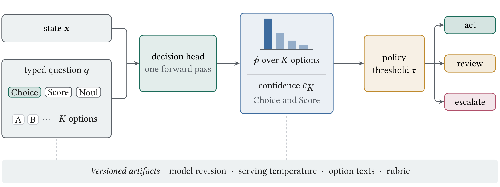
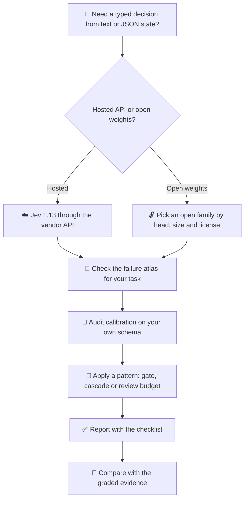
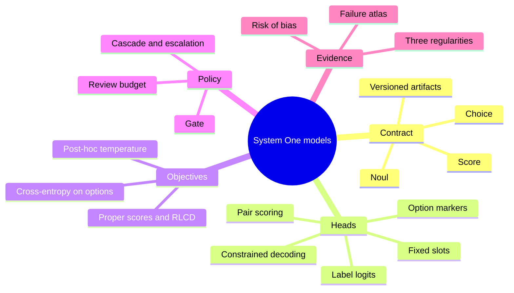
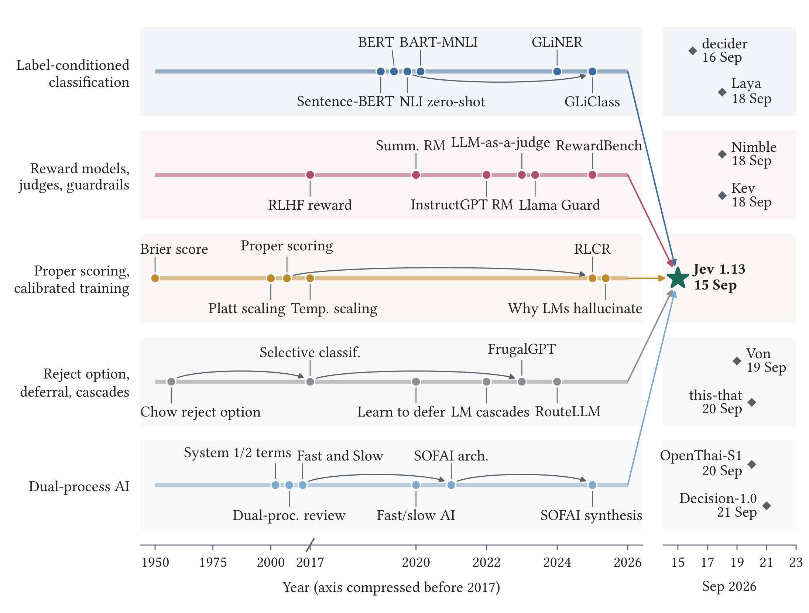
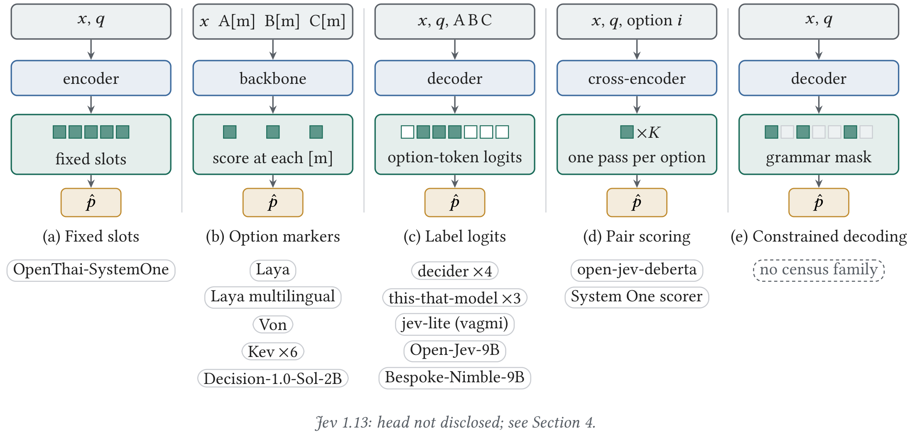

<div align="center">

# 🧭 Awesome System One Models
### *Typed probabilistic decision models: a curated, evidence-graded map of the contract, the models and the failures*

<p align="center">
  
</p>

[](https://awesome.re)
[](https://creativecommons.org/licenses/by/4.0/)
[](https://github.com/pozapas/awesome-system-one-models)
[](CONTRIBUTING.md)
[](https://github.com/pozapas/awesome-system-one-models/commits/main)
[](#-at-a-glance)
[](#-cutoff-and-versioning)

</div>

---

<div align="center">

Maintained alongside &nbsp;<strong>From Calibrated Classifiers to Decision Contracts: A Survey of System One Models</strong> &nbsp;·&nbsp; Rafe and Das, <em>manuscript under review</em> &nbsp; 

</div>

---

<div align="center">

### 🎯 *"A decision model is a new contract, not a new kind of intelligence."*

**213 registry-verified papers · 27 graded studies · 108 models · 54 datasets · 127 tools**  
*Organized by the survey's own structure: genealogy, anatomy, census, evidence, failures, patterns and reporting*

[🧩 Concept](#-what-is-a-system-one-model) • [🌳 Genealogy](#-genealogy) • [🤖 Models](#-models) • [🔬 Evidence](#-evidence) • [🧨 Failure atlas](#-failure-atlas) • [🧱 Patterns](#-design-patterns) • [🤝 Contribute](CONTRIBUTING.md) • [📝 Cite](#-how-to-cite)

</div>

---

## 📌 Contents

<table><tr><td valign="top">

1. [🧩 What is a System One model?](#-what-is-a-system-one-model)
2. [🚀 Quick Start](#-quick-start)
3. [📊 At a glance](#-at-a-glance)
4. [🗺️ Taxonomy](#️-taxonomy)
5. [🌳 Genealogy](#-genealogy)
6. [🤖 Models](#-models)
7. [📚 Datasets and benchmarks](#-datasets-and-benchmarks)
8. [🛠️ Harnesses and tooling](#️-harnesses-and-tooling)
9. [🔬 Evidence](#-evidence)

</td><td valign="top">

10. [🧨 Failure atlas](#-failure-atlas)
11. [🧱 Design patterns](#-design-patterns)
12. [✅ Reporting checklist in brief](#-reporting-checklist-in-brief)
13. [📖 Surveys and related resources](#-surveys-and-related-resources)
14. [🤝 Contributing](#-contributing)
15. [📝 How to cite](#-how-to-cite)
16. [🕒 Cutoff and versioning](#-cutoff-and-versioning)
17. [📜 License](#-license)
18. [👥 Authors and maintainers](#-authors-and-maintainers)

</td></tr></table>

## 🧩 What is a System One model?

A System One model, also called a typed probabilistic decision model, maps a state and a caller-declared typed question to a probability distribution over a finite answer space, in one forward pass and without generating text. The question is one of three primitives, **Choice** over named options, **Score** over ordered levels, or **Noul** for a yes-or-no judgment, and the model promises that the returned probabilities are calibrated. The survey reads this as a new contract assembled from five older research lines rather than as a new kind of intelligence, so the unit of evaluation is the contract together with the policy that consumes the probability and chooses to act, review or escalate. The versioned artifacts drawn along the bottom of the figure above (model revision, serving temperature, option texts and rubric) belong to the contract, because a change in any of them yields a different predictor.

| Primitive | Answer space | Returned | Confidence value |
| --- | --- | --- | --- |
| **Choice** | Declared options (up to 255 on the hosted model) | Distribution over the options | Yes |
| **Score** | Ordered levels (2 to 10 on the hosted model) | Distribution over the levels | Yes |
| **Noul** | Yes or no | Probability of yes | Not returned by the hosted model |

## 🚀 Quick Start



## 📊 At a glance

<details>
<summary>📊 <strong>Repository statistics</strong> (click to expand)</summary>

- **📄 Registry-verified papers**: 213, of which 166 sit in the five genealogy streams S1 36, S2 26, S3 51, S4 40, S5 13
- **☁️ Hosted decision models**: 1 (Jev 1.13, TypeSafe AI)
- **🔓 Open original implementations on Hugging Face (T1)**: 104 checkpoints in 68 families, 15 backbone families, first releases 2026-09-16 to 2026-09-24
- **🧬 Derivatives (T2)**: 256 (format conversions 142, quantizations 9, language fine-tunes 10, domain fine-tunes 6, merges 4, other 85)
- **📚 Datasets**: 54 typed-decision datasets on Hugging Face, 8 with a full card
- **🐙 GitHub repositories screened**: 226 (local servers 48, integrations 54, applications 47, open-model training 36, evaluation 25)
- **🔬 Evidence ledger**: 394 extracted values from 27 studies; risk of bias low 0, some concerns 15, high 12
- **🧨 Failure modes**: 15 · **🧱 Design patterns**: 13 · **✅ Checklist items**: 16 in 5 groups
- **🕒 Cutoff**: 2026-09-24 (v1.0)

</details>

## 🗺️ Taxonomy

The list follows the survey's conceptual structure. A decision model is described by its contract, its head and its objective. It is placed in the ecosystem by the census, judged by the graded evidence, and deployed through patterns that answer documented failure modes.



## 🌳 Genealogy

The decision contract is best read as a convergence of five older research lines rather than as an invention of September 2026. The timeline places each stream on its own lane; the right panel shows the open implementations that followed the hosted release within days. Papers marked 📖 are discussed in the survey; the others come from the same registry-verified bibliography.

<p align="center"></p>

| Stream | Contributes | Papers |
| --- | --- | --- |
| 🏷️ [Label-conditioned scoring heads](#️-s1-label-conditioned-scoring-heads) | the scoring head | 36 |
| ⚖️ [Reward models, verifiers, judges and guardrail classifiers](#️-s2-reward-models-verifiers-judges-and-guardrail-classifiers) | the verdict role | 26 |
| 🎯 [Proper scoring rules and calibrated training](#-s3-proper-scoring-rules-and-calibrated-training) | the training target | 51 |
| 🚦 [The reject option and its descendants](#-s4-the-reject-option-and-its-descendants) | the policy that acts on the probability | 40 |
| 🧠 [Dual-process architectures and the System One name](#-s5-dual-process-architectures-and-the-system-one-name) | the fast-solver role and the name | 13 |

### 🏷️ S1 Label-conditioned scoring heads

> Classification over a declared label set, from pretrained encoders to entailment-based zero-shot classification and label-in-context models. Once labels are read as text, their wording and order become part of the input.

<details>
<summary><strong>36 papers</strong>, 13 discussed in the survey</summary>

| Year | Title | First author | Venue |
| ---: | --- | --- | --- |
| 1995 | [Solving Multiclass Learning Problems via Error-Correcting Output Codes](https://doi.org/10.1613/jair.105) | Dietterich | Journal of Artificial Intelligence Research |
| 1997 | [A Decision-Theoretic Generalization of On-Line Learning and an Application to Boosting](https://doi.org/10.1006/jcss.1997.1504) | Freund | Journal of Computer and System Sciences |
| 1997 | [On the Optimality of the Simple Bayesian Classifier under Zero-One Loss](https://doi.org/10.1023/a:1007413511361) | Domingos | Machine Learning |
| 2001 | [On Discriminative vs. Generative Classifiers: A Comparison of Logistic Regression and Naive Bayes](https://proceedings.neurips.cc/paper/2001/hash/7b7a53e239400a13bd6be6c91c4f6c4e-Abstract.html) 📖 | Ng | NeurIPS |
| 2004 | [Ensemble selection from libraries of models](https://doi.org/10.1145/1015330.1015432) | Caruana | Twenty-first international conference on … |
| 2019 | [BERT: Pre-training of Deep Bidirectional Transformers for Language Understanding](https://doi.org/10.18653/v1/n19-1423) 📖 | Devlin | NAACL |
| 2019 | [Benchmarking Zero-shot Text Classification: Datasets, Evaluation and Entailment Approach](https://doi.org/10.18653/v1/d19-1404) 📖 | Yin | EMNLP |
| 2019 | [DistilBERT, a distilled version of BERT: smaller, faster, cheaper and lighter](https://arxiv.org/abs/1910.01108) | Sanh | arXiv |
| 2019 | [Passage Re-ranking with BERT](https://arxiv.org/abs/1901.04085) | Nogueira | arXiv |
| 2019 | [RoBERTa: A Robustly Optimized BERT Pretraining Approach](https://arxiv.org/abs/1907.11692) | Liu | arXiv |
| 2019 | [Sentence-BERT: Sentence Embeddings using Siamese BERT-Networks](https://doi.org/10.18653/v1/d19-1410) 📖 | Reimers | EMNLP |
| 2019 | [Zero-shot Text Classification With Generative Language Models](https://arxiv.org/abs/1912.10165) | Puri | arXiv |
| 2020 | [BART: Denoising Sequence-to-Sequence Pre-training for Natural Language Generation, Translation, and Comprehension](https://doi.org/10.18653/v1/2020.acl-main.703) 📖 | Lewis | ACL |
| 2020 | [ColBERT: Efficient and Effective Passage Search via Contextualized Late Interaction over BERT](https://doi.org/10.1145/3397271.3401075) | Khattab | Proceedings of the 43rd International ACM … |
| 2020 | [DeBERTa: Decoding-enhanced BERT with Disentangled Attention](https://arxiv.org/abs/2006.03654) | He | arXiv |
| 2020 | [Language Models are Few-Shot Learners](https://arxiv.org/abs/2005.14165) 📖 | Brown | arXiv |
| 2021 | [Calibrate Before Use: Improving Few-Shot Performance of Language Models](https://arxiv.org/abs/2102.09690) 📖 | Zhao | arXiv |
| 2021 | [Entailment as Few-Shot Learner](https://arxiv.org/abs/2104.14690) | Wang | arXiv |
| 2021 | [Exploiting Cloze-Questions for Few-Shot Text Classification and Natural Language Inference](https://doi.org/10.18653/v1/2021.eacl-main.20) 📖 | Schick | EACL |
| 2021 | [Making Pre-trained Language Models Better Few-shot Learners](https://doi.org/10.18653/v1/2021.acl-long.295) | Gao | ACL |
| 2021 | [Surface Form Competition: Why the Highest Probability Answer Isn’t Always Right](https://doi.org/10.18653/v1/2021.emnlp-main.564) | Holtzman | EMNLP |
| 2021 | [The Power of Scale for Parameter-Efficient Prompt Tuning](https://doi.org/10.18653/v1/2021.emnlp-main.243) | Lester | EMNLP |
| 2021 | [True Few-Shot Learning with Language Models](https://arxiv.org/abs/2105.11447) | Perez | arXiv |
| 2022 | [Efficient Few-Shot Learning Without Prompts](https://arxiv.org/abs/2209.11055) | Tunstall | arXiv |
| 2022 | [Leveraging Large Language Models for Multiple Choice Question Answering](https://arxiv.org/abs/2210.12353) 📖 | Robinson | arXiv |
| 2022 | [Noisy Channel Language Model Prompting for Few-Shot Text Classification](https://doi.org/10.18653/v1/2022.acl-long.365) | Min | ACL |
| 2022 | [Prompt-free and Efficient Few-shot Learning with Language Models](https://doi.org/10.18653/v1/2022.acl-long.254) | Karimi Mahabadi | ACL |
| 2023 | [Large Language Models Are Not Robust Multiple Choice Selectors](https://arxiv.org/abs/2309.03882) 📖 | Zheng | arXiv |
| 2023 | [Quantifying Language Models' Sensitivity to Spurious Features in Prompt Design or: How I learned to start worrying about prompt formatting](https://arxiv.org/abs/2310.11324) | Sclar | arXiv |
| 2024 | [GLiNER: Generalist Model for Named Entity Recognition using Bidirectional Transformer](https://doi.org/10.18653/v1/2024.naacl-long.300) 📖 | Zaratiana | NAACL |
| 2024 | [Large Language Models Sensitivity to The Order of Options in Multiple-Choice Questions](https://doi.org/10.18653/v1/2024.findings-naacl.130) | Pezeshkpour | Findings of ACL |
| 2025 | [GLiClass: Generalist Lightweight Model for Sequence Classification Tasks](https://arxiv.org/abs/2508.07662) 📖 | Stepanov | arXiv |
| 2025 | [Smarter, Better, Faster, Longer: A Modern Bidirectional Encoder for Fast, Memory Efficient, and Long Context Finetuning and Inference](https://doi.org/10.18653/v1/2025.acl-long.127) 📖 | Warner | ACL |
| 2025 | [Text Classification in the LLM Era – Where do we stand?](https://arxiv.org/abs/2502.11830) | Vajjala | arXiv |
| 2025 | [mmBERT: A Modern Multilingual Encoder with Annealed Language Learning](https://arxiv.org/abs/2509.06888) | Marone | arXiv |
| 2026 | [Large Language Models for Text Classification: From Zero-Shot Learning to Instruction-Tuning](https://doi.org/10.1177/00491241251325243) | Chae | Sociological Methods & Research |

</details>

### ⚖️ S2 Reward models, verifiers, judges and guardrail classifiers

> Scorers that map a state and a set of candidates to a probability of preference, correctness or safety, together with the catalogue of biases that sway a model reading the candidates it must choose among.

<details>
<summary><strong>26 papers</strong>, 14 discussed in the survey</summary>

| Year | Title | First author | Venue |
| ---: | --- | --- | --- |
| 2017 | [Deep reinforcement learning from human preferences](https://arxiv.org/abs/1706.03741) 📖 | Christiano | arXiv |
| 2020 | [Learning to summarize from human feedback](https://arxiv.org/abs/2009.01325) 📖 | Stiennon | arXiv |
| 2021 | [Training Verifiers to Solve Math Word Problems](https://arxiv.org/abs/2110.14168) 📖 | Cobbe | arXiv |
| 2022 | [A New Generation of Perspective API: Efficient Multilingual Character-level Transformers](https://doi.org/10.1145/3534678.3539147) | Lees | KDD |
| 2022 | [Solving math word problems with process- and outcome-based feedback](https://arxiv.org/abs/2211.14275) | Uesato | arXiv |
| 2022 | [Training Language Models to Follow Instructions with Human Feedback](https://doi.org/10.52202/068431-2011) 📖 | Ouyang | NeurIPS |
| 2022 | [Training a Helpful and Harmless Assistant with Reinforcement Learning from Human Feedback](https://arxiv.org/abs/2204.05862) | Bai | arXiv |
| 2023 | [A Holistic Approach to Undesired Content Detection in the Real World](https://doi.org/10.1609/aaai.v37i12.26752) 📖 | Markov | AAAI |
| 2023 | [Can Large Language Models Be an Alternative to Human Evaluations?](https://doi.org/10.18653/v1/2023.acl-long.870) | Chiang | ACL |
| 2023 | [Direct Preference Optimization: Your Language Model is Secretly a Reward Model](https://doi.org/10.52202/075280-2338) | Rafailov | NeurIPS |
| 2023 | [G-Eval: NLG Evaluation using Gpt-4 with Better Human Alignment](https://doi.org/10.18653/v1/2023.emnlp-main.153) 📖 | Liu | EMNLP |
| 2023 | [Judging LLM-as-a-Judge with MT-Bench and Chatbot Arena](https://doi.org/10.52202/075280-2020) 📖 | Zheng | NeurIPS |
| 2023 | [Let's Verify Step by Step](https://arxiv.org/abs/2305.20050) 📖 | Lightman | arXiv |
| 2023 | [Llama Guard: LLM-based Input-Output Safeguard for Human-AI Conversations](https://arxiv.org/abs/2312.06674) 📖 | Inan | arXiv |
| 2023 | [PandaLM: An Automatic Evaluation Benchmark for LLM Instruction Tuning Optimization](https://arxiv.org/abs/2306.05087) | Wang | arXiv |
| 2023 | [Prometheus: Inducing Fine-grained Evaluation Capability in Language Models](https://arxiv.org/abs/2310.08491) | Kim | arXiv |
| 2024 | [A Survey on LLM-as-a-Judge](https://arxiv.org/abs/2411.15594) | Gu | arXiv |
| 2024 | [Justice or Prejudice? Quantifying Biases in LLM-as-a-Judge](https://arxiv.org/abs/2410.02736) 📖 | Ye | arXiv |
| 2024 | [LLM Evaluators Recognize and Favor Their Own Generations](https://doi.org/10.52202/079017-2197) 📖 | Panickssery | NeurIPS |
| 2024 | [Large Language Models are not Fair Evaluators](https://doi.org/10.18653/v1/2024.acl-long.511) | Wang | ACL |
| 2024 | [Length-Controlled AlpacaEval: A Simple Way to Debias Automatic Evaluators](https://arxiv.org/abs/2404.04475) 📖 | Dubois | arXiv |
| 2024 | [Math-Shepherd: Verify and Reinforce LLMs Step-by-step without Human Annotations](https://doi.org/10.18653/v1/2024.acl-long.510) | Wang | ACL |
| 2024 | [Prometheus 2: An Open Source Language Model Specialized in Evaluating Other Language Models](https://doi.org/10.18653/v1/2024.emnlp-main.248) | Kim | EMNLP |
| 2024 | [ShieldGemma: Generative AI Content Moderation Based on Gemma](https://arxiv.org/abs/2407.21772) 📖 | Zeng | arXiv |
| 2025 | [RewardBench 2: Advancing Reward Model Evaluation](https://arxiv.org/abs/2506.01937) | Malik | arXiv |
| 2025 | [RewardBench: Evaluating Reward Models for Language Modeling](https://doi.org/10.18653/v1/2025.findings-naacl.96) 📖 | Lambert | Findings of ACL |

</details>

### 🎯 S3 Proper scoring rules and calibrated training

> Strictly proper scores, post-hoc calibration and calibration-aware rewards. Training against a proper score is training for calibration, which is the meaning of the decision model's promise.

<details>
<summary><strong>51 papers</strong>, 20 discussed in the survey</summary>

| Year | Title | First author | Venue |
| ---: | --- | --- | --- |
| 1950 | [Verification of Forecasts Expressed in Terms of Probability](https://doi.org/10.1175/1520-0493%281950%29078%3C0001:vofeit%3E2.0.co%3B2) 📖 | Brier | Monthly Weather Review |
| 1969 | [A Scoring System for Probability Forecasts of Ranked Categories](https://doi.org/10.1175/1520-0450%281969%29008%3C0985:assfpf%3E2.0.co%3B2) 📖 | Epstein | Journal of Applied Meteorology |
| 1973 | [A New Vector Partition of the Probability Score](https://doi.org/10.1175/1520-0450%281973%29012%3C0595:anvpot%3E2.0.co%3B2) 📖 | Murphy | Journal of Applied Meteorology |
| 1982 | [The Well-Calibrated Bayesian: Rejoinder](https://doi.org/10.2307/2287723) | Dawid | Journal of the American Statistical Association |
| 1983 | [The Comparison and Evaluation of Forecasters](https://doi.org/10.2307/2987588) | DeGroot | The Statistician |
| 1996 | [Scoring rules and the evaluation of probabilities](https://doi.org/10.1007/bf02562681) | Winkler | Test |
| 1998 | [Asymptotic calibration](https://doi.org/10.1093/biomet/85.2.379) | Foster | Biometrika |
| 2002 | [Transforming classifier scores into accurate multiclass probability estimates](https://doi.org/10.1145/775047.775151) 📖 | Zadrozny | KDD |
| 2005 | [Predicting good probabilities with supervised learning](https://doi.org/10.1145/1102351.1102430) | Niculescu-Mizil | Proceedings of the 22nd international … |
| 2006 | [An Introduction to Copulas](https://doi.org/10.1007/0-387-28678-0) 📖 |  | Springer New York |
| 2007 | [Probabilistic Forecasts, Calibration and Sharpness](https://doi.org/10.1111/j.1467-9868.2007.00587.x) | Gneiting | Journal of the Royal Statistical Society … |
| 2007 | [Strictly Proper Scoring Rules, Prediction, and Estimation](https://doi.org/10.1198/016214506000001437) 📖 | Gneiting | Journal of the American Statistical Association |
| 2009 | [Reliability, sufficiency, and the decomposition of proper scores](https://doi.org/10.1002/qj.456) | Bröcker | Quarterly Journal of the Royal Meteorological … |
| 2009 | [The Elements of Statistical Learning: Data Mining, Inference, and Prediction](https://doi.org/10.1007/978-0-387-84858-7) | Hastie | Springer |
| 2012 | [Calibrating predictive model estimates to support personalized medicine](https://doi.org/10.1136/amiajnl-2011-000291) | Jiang | Journal of the American Medical Informatics … |
| 2015 | [Dropout as a Bayesian Approximation: Representing Model Uncertainty in Deep Learning](https://arxiv.org/abs/1506.02142) | Gal | arXiv |
| 2015 | [Obtaining Well Calibrated Probabilities Using Bayesian Binning](https://doi.org/10.1609/aaai.v29i1.9602) | Pakdaman Naeini | AAAI |
| 2016 | [Simple and Scalable Predictive Uncertainty Estimation using Deep Ensembles](https://arxiv.org/abs/1612.01474) | Lakshminarayanan | arXiv |
| 2017 | [Beyond sigmoids: How to obtain well-calibrated probabilities from binary classifiers with beta calibration](https://doi.org/10.1214/17-ejs1338si) | Kull | Electronic Journal of Statistics |
| 2017 | [On Calibration of Modern Neural Networks](https://arxiv.org/abs/1706.04599) 📖 | Guo | arXiv |
| 2018 | [Accurate Uncertainties for Deep Learning Using Calibrated Regression](https://arxiv.org/abs/1807.00263) | Kuleshov | arXiv |
| 2019 | [Beyond temperature scaling: Obtaining well-calibrated multiclass probabilities with Dirichlet calibration](https://arxiv.org/abs/1910.12656) 📖 | Kull | arXiv |
| 2019 | [Calibration tests in multi-class classification: A unifying framework](https://arxiv.org/abs/1910.11385) | Widmann | arXiv |
| 2019 | [Can You Trust Your Model's Uncertainty? Evaluating Predictive Uncertainty Under Dataset Shift](https://arxiv.org/abs/1906.02530) | Ovadia | arXiv |
| 2019 | [Evaluating model calibration in classification](https://arxiv.org/abs/1902.06977) | Vaicenavicius | arXiv |
| 2019 | [Measuring Calibration in Deep Learning](https://arxiv.org/abs/1904.01685) | Nixon | arXiv |
| 2019 | [Verified Uncertainty Calibration](https://arxiv.org/abs/1909.10155) 📖 | Kumar | arXiv |
| 2020 | [Calibration of Pre-trained Transformers](https://doi.org/10.18653/v1/2020.emnlp-main.21) | Desai | EMNLP |
| 2020 | [Mitigating Bias in Calibration Error Estimation](https://arxiv.org/abs/2012.08668) | Roelofs | arXiv |
| 2020 | [Uncertainty Quantification and Deep Ensembles](https://arxiv.org/abs/2007.08792) | Rahaman | arXiv |
| 2021 | [Distribution-free calibration guarantees for histogram binning without sample splitting](https://arxiv.org/abs/2105.04656) | Gupta | arXiv |
| 2021 | [How Can We Know When Language Models Know? On the Calibration of Language Models for Question Answering](https://doi.org/10.1162/tacl_a_00407) | Jiang | TACL |
| 2021 | [Revisiting the Calibration of Modern Neural Networks](https://arxiv.org/abs/2106.07998) 📖 | Minderer | arXiv |
| 2021 | [Second opinion needed: communicating uncertainty in medical machine learning](https://doi.org/10.1038/s41746-020-00367-3) | Kompa | npj Digital Medicine |
| 2022 | [Language Models (Mostly) Know What They Know](https://arxiv.org/abs/2207.05221) 📖 | Kadavath | arXiv |
| 2022 | [Teaching Models to Express Their Uncertainty in Words](https://arxiv.org/abs/2205.14334) | Lin | arXiv |
| 2023 | [A Unifying Theory of Distance from Calibration](https://doi.org/10.1145/3564246.3585182) | Błasiok | Proceedings of the 55th Annual ACM Symposium … |
| 2023 | [Can LLMs Express Their Uncertainty? An Empirical Evaluation of Confidence Elicitation in LLMs](https://arxiv.org/abs/2306.13063) 📖 | Xiong | arXiv |
| 2023 | [Classifier calibration: a survey on how to assess and improve predicted class probabilities](https://doi.org/10.1007/s10994-023-06336-7) | Silva Filho | Machine Learning |
| 2023 | [Just Ask for Calibration: Strategies for Eliciting Calibrated Confidence Scores from Language Models Fine-Tuned with Human Feedback](https://doi.org/10.18653/v1/2023.emnlp-main.330) | Tian | EMNLP |
| 2024 | [A Survey of Confidence Estimation and Calibration in Large Language Models](https://doi.org/10.18653/v1/2024.naacl-long.366) 📖 | Geng | NAACL |
| 2024 | [Calibrated Language Models Must Hallucinate](https://doi.org/10.1145/3618260.3649777) 📖 | Kalai | Proceedings of the 56th Annual ACM Symposium … |
| 2024 | [LACIE: Listener-Aware Finetuning for Calibration in Large Language Models](https://doi.org/10.52202/079017-1364) | Stengel-Eskin | NeurIPS |
| 2024 | [Linguistic Calibration of Long-Form Generations](https://arxiv.org/abs/2404.00474) 📖 | Band | arXiv |
| 2025 | [Beyond Binary Rewards: Training LMs to Reason About Their Uncertainty](https://arxiv.org/abs/2507.16806) | Damani | arXiv |
| 2025 | [Confidence-Aware Routing for Large Language Model Reliability Enhancement: A Multi-Signal Approach to Pre-Generation Hallucination Mitigation](https://arxiv.org/abs/2510.01237) 📖 | M | arXiv |
| 2025 | [SalesRLAgent: A Reinforcement Learning Approach for Real-Time Sales Conversion Prediction and Optimization](https://arxiv.org/abs/2503.23303) 📖 | M | arXiv |
| 2025 | [Uncertainty Quantification and Confidence Calibration in Large Language Models: A Survey](https://doi.org/10.1145/3711896.3736569) 📖 | Liu | KDD |
| 2025 | [Why Language Models Hallucinate](https://arxiv.org/abs/2509.04664) 📖 | Kalai | arXiv |
| 2026 | [A Survey on Uncertainty Quantification of Large Language Models: Taxonomy, Open Research Challenges, and Future Directions](https://doi.org/10.1145/3744238) 📖 | Shorinwa | ACM Computing Surveys |
| 2026 | [Balancing Classification and Calibration Performance in Decision-Making LLMs via Calibration Aware Reinforcement Learning](https://doi.org/10.18653/v1/2026.findings-acl.610) | Yaldiz | Findings of ACL |

</details>

### 🚦 S4 The reject option and its descendants

> The reject option, selective classification, learning to defer, conformal sets and model cascades. This stream turns a returned probability into an action such as act, review or escalate.

<details>
<summary><strong>40 papers</strong>, 24 discussed in the survey</summary>

| Year | Title | First author | Venue |
| ---: | --- | --- | --- |
| 1952 | [A Generalization of Sampling Without Replacement from a Finite Universe](https://doi.org/10.1080/01621459.1952.10483446) 📖 | Horvitz | Journal of the American Statistical Association |
| 1957 | [An optimum character recognition system using decision functions](https://doi.org/10.1109/tec.1957.5222035) 📖 | Chow | IRE Transactions on Electronic Computers |
| 1970 | [On optimum recognition error and reject tradeoff](https://doi.org/10.1109/tit.1970.1054406) 📖 | Chow | IEEE Transactions on Information Theory |
| 1995 | [Active Learning with Statistical Models](https://doi.org/10.21236/ada295617) | Cohn | Defense Technical Information Center |
| 2001 | [Rapid Object Detection Using a Boosted Cascade of Simple Features](https://doi.org/10.1109/CVPR.2001.990517) 📖 | Viola | CVPR |
| 2005 | [Algorithmic Learning in a Random World](https://doi.org/10.1007/b106715) | Vovk | Springer |
| 2006 | [Classification with reject option](https://doi.org/10.1002/cjs.5550340410) | Herbei | Canadian Journal of Statistics |
| 2007 | [A tutorial on conformal prediction](https://arxiv.org/abs/0706.3188) | Shafer | arXiv |
| 2010 | [On the Foundations of Noise-free Selective Classification](https://jmlr.org/papers/v11/el-yaniv10a.html) 📖 | El-Yaniv | JMLR |
| 2011 | [Bayesian Active Learning for Classification and Preference Learning](https://arxiv.org/abs/1112.5745) | Houlsby | arXiv |
| 2013 | [Conditional validity of inductive conformal predictors](https://doi.org/10.1007/s10994-013-5355-6) | Vovk | Machine Learning |
| 2016 | [A Baseline for Detecting Misclassified and Out-of-Distribution Examples in Neural Networks](https://arxiv.org/abs/1610.02136) | Hendrycks | arXiv |
| 2016 | [Learning with Rejection](https://doi.org/10.1007/978-3-319-46379-7_5) 📖 | Cortes | Lecture Notes in Computer Science |
| 2017 | [Adaptive Classification for Prediction Under a Budget](https://arxiv.org/abs/1705.10194) | Nan | arXiv |
| 2017 | [Predict Responsibly: Improving Fairness and Accuracy by Learning to Defer](https://arxiv.org/abs/1711.06664) 📖 | Madras | arXiv |
| 2017 | [Selective Classification for Deep Neural Networks](https://arxiv.org/abs/1705.08500) 📖 | Geifman | arXiv |
| 2019 | [End to end learning and optimization on graphs](https://arxiv.org/abs/1905.13732) | Wilder | arXiv |
| 2019 | [SelectiveNet: A Deep Neural Network with an Integrated Reject Option](https://arxiv.org/abs/1901.09192) | Geifman | arXiv |
| 2020 | [Classification with Valid and Adaptive Coverage](https://arxiv.org/abs/2006.02544) 📖 | Romano | arXiv |
| 2020 | [Consistent Estimators for Learning to Defer to an Expert](https://arxiv.org/abs/2006.01862) 📖 | Mozannar | arXiv |
| 2020 | [Selective Question Answering under Domain Shift](https://doi.org/10.18653/v1/2020.acl-main.503) 📖 | Kamath | ACL |
| 2021 | [Active Testing: Sample-Efficient Model Evaluation](https://arxiv.org/abs/2103.05331) 📖 | Kossen | arXiv |
| 2021 | [Distribution-free, Risk-controlling Prediction Sets](https://doi.org/10.1145/3478535) 📖 | Bates | Journal of the ACM |
| 2022 | [Conformal Risk Control](https://arxiv.org/abs/2208.02814) 📖 | Angelopoulos | arXiv |
| 2022 | [Investigating Selective Prediction Approaches Across Several Tasks in IID, OOD, and Adversarial Settings](https://doi.org/10.18653/v1/2022.findings-acl.158) | Varshney | Findings of ACL |
| 2022 | [Language Model Cascades](https://arxiv.org/abs/2207.10342) 📖 | Dohan | arXiv |
| 2022 | [Post-Hoc Estimators for Learning to Defer to an Expert](https://doi.org/10.52202/068431-2124) | Narasimhan | NeurIPS |
| 2023 | [Conformal Language Modeling](https://arxiv.org/abs/2306.10193) | Quach | arXiv |
| 2023 | [Conformal Prediction with Large Language Models for Multi-Choice Question Answering](https://arxiv.org/abs/2305.18404) 📖 | Kumar | arXiv |
| 2023 | [Conformal Prediction: A Gentle Introduction](https://doi.org/10.1561/2200000101) 📖 | Angelopoulos | Foundations and Trends in Machine Learning |
| 2023 | [FrugalGPT: How to Use Large Language Models While Reducing Cost and Improving Performance](https://arxiv.org/abs/2305.05176) 📖 | Chen | arXiv |
| 2023 | [Large Language Model Cascades with Mixture of Thoughts Representations for Cost-efficient Reasoning](https://arxiv.org/abs/2310.03094) | Yue | arXiv |
| 2023 | [When Does Confidence-Based Cascade Deferral Suffice?](https://doi.org/10.52202/075280-0431) 📖 | Jitkrittum | NeurIPS |
| 2023 | [Who Should Predict? Exact Algorithms For Learning to Defer to Humans](https://arxiv.org/abs/2301.06197) | Mozannar | arXiv |
| 2024 | [AutoMix: Automatically Mixing Language Models](https://doi.org/10.52202/079017-4164) | Aggarwal | NeurIPS |
| 2024 | [Machine learning with a reject option: a survey](https://doi.org/10.1007/s10994-024-06534-x) 📖 | Hendrickx | Machine Learning |
| 2024 | [RouteLLM: Learning to Route LLMs with Preference Data](https://arxiv.org/abs/2406.18665) 📖 | Ong | arXiv |
| 2025 | [Learning to Defer: A Survey](https://doi.org/10.5281/zenodo.17843044) 📖 | Strong |  |
| 2026 | [Doing More with Less: A Survey on Routing Strategies for Resource Optimisation in Large Language Model-Based Systems](https://doi.org/10.1613/jair.1.19801) 📖 | Varangot-Reille | Journal of Artificial Intelligence Research |
| 2026 | [Dynamic Model Routing and Cascading for Efficient LLM Inference: A Survey](https://arxiv.org/abs/2603.04445) 📖 | Moslem | arXiv |

</details>

### 🧠 S5 Dual-process architectures and the System One name

> Dual-process accounts of reasoning and the fast and slow AI architectures that borrow them. The stream supplies the fast-solver role in a larger program and the System One label.

<details>
<summary><strong>13 papers</strong>, 8 discussed in the survey</summary>

| Year | Title | First author | Venue |
| ---: | --- | --- | --- |
| 1996 | [The empirical case for two systems of reasoning](https://doi.org/10.1037/0033-2909.119.1.3) | Sloman | Psychological Bulletin |
| 2002 | [Individual Differences in Reasoning: Implications for the Rationality Debate?](https://doi.org/10.1017/cbo9780511808098.026) 📖 | Stanovich | Heuristics and Biases |
| 2002 | [Representativeness Revisited: Attribute Substitution in Intuitive Judgment](https://doi.org/10.1017/cbo9780511808098.004) | Kahneman | Heuristics and Biases |
| 2008 | [Dual-Processing Accounts of Reasoning, Judgment, and Social Cognition](https://doi.org/10.1146/annurev.psych.59.103006.093629) 📖 | Evans | Annual Review of Psychology |
| 2010 | [Dual‐Process and Dual‐System Theories of Reasoning](https://doi.org/10.1111/j.1747-9991.2010.00330.x) | Frankish | Philosophy Compass |
| 2013 | [Dual-Process Theories of Higher Cognition: Advancing the Debate](https://doi.org/10.1177/1745691612460685) | Evans | Perspectives on Psychological Science |
| 2020 | [Thinking Fast and Slow in AI](https://arxiv.org/abs/2010.06002) 📖 | Booch | arXiv |
| 2021 | [Thinking Fast and Slow in AI: the Role of Metacognition](https://arxiv.org/abs/2110.01834) 📖 | Ganapini | arXiv |
| 2023 | [Human-like intuitive behavior and reasoning biases emerged in large language models but disappeared in ChatGPT](https://doi.org/10.1038/s43588-023-00527-x) 📖 | Hagendorff | Nature Computational Science |
| 2023 | [SwiftSage: A Generative Agent with Fast and Slow Thinking for Complex Interactive Tasks](https://doi.org/10.52202/075280-1034) 📖 | Lin | NeurIPS |
| 2025 | [Dual-process theory and decision-making in large language models](https://doi.org/10.1038/s44159-025-00506-1) | Brady | Nature Reviews Psychology |
| 2025 | [Fast, slow, and metacognitive thinking in AI](https://doi.org/10.1038/s44387-025-00027-5) 📖 | Bergamaschi Ganapini | npj Artificial Intelligence |
| 2025 | [Thinking Fast and Slow in Human and Machine Intelligence](https://doi.org/10.1145/3715709) 📖 | Fabiano | Communications of the ACM |

</details>

## 🤖 Models

### ☁️ Hosted model

**Jev 1.13** from TypeSafe AI launched on 15 September 2026 with the post that introduced the System One name. Its weights, architecture and RLCD training recipe are not published, so statements about its internals rest on the vendor's own descriptions or on black-box probing. The facts below are the vendor's, as documented on the access date.

| Fact | Value | Source |
| --- | --- | --- |
| Pinned model ID | jev-1.13.0 | [link](https://docs.typesafe.ai/models) |
| jev-latest resolves to | jev-1.13.0 | [link](https://docs.typesafe.ai/models) |
| Choice options (max) | 255 | [link](https://docs.typesafe.ai/primitives/choice) |
| Score levels (min) | 2 | [link](https://docs.typesafe.ai/primitives/score) |
| Score levels (max) | 10 | [link](https://docs.typesafe.ai/primitives/score) |
| State budget | 32k tokens (state plus the longest question) | [link](https://docs.typesafe.ai/models) |
| Request budget | 64k tokens (state plus all questions) | [link](https://docs.typesafe.ai/models) |
| Input price, USD per million tokens | 0.042 | [link](https://docs.typesafe.ai/models) |
| Output price | free (not metered) | [link](https://docs.typesafe.ai/models) |
| Stated latency | 70 to 500 ms end to end (vendor claim) | [link](https://typesafe.ai/blog/introducing-system-one-models-and-jev) |
| Confidence on Noul | not returned (Choice and Score only) | [link](https://docs.typesafe.ai/confidence) |
| Jaggedness page last reviewed | 2026-09-17 | [link](https://docs.typesafe.ai/model-jaggedness/jev-1.13) |

<details>
<summary>📘 <strong>Vendor documentation and access points</strong> (17 pages)</summary>

| Page | Publisher | Page date | Accessed |
| --- | --- | --- | --- |
| [Introduction](https://docs.typesafe.ai/introduction) | TypeSafe AI | 2026-09-20 (sitemap lastmod) | 2026-09-24 |
| [System One](https://docs.typesafe.ai/concepts/system-one) | TypeSafe AI | 2026-09-17 (sitemap lastmod) | 2026-09-24 |
| [Models](https://docs.typesafe.ai/models) | TypeSafe AI | 2026-09-22 (sitemap lastmod) | 2026-09-24 |
| [Choice](https://docs.typesafe.ai/primitives/choice) | TypeSafe AI | 2026-09-20 (sitemap lastmod) | 2026-09-24 |
| [Score](https://docs.typesafe.ai/primitives/score) | TypeSafe AI | 2026-09-20 (sitemap lastmod) | 2026-09-24 |
| [Noul](https://docs.typesafe.ai/primitives/noul) | TypeSafe AI | 2026-09-20 (sitemap lastmod) | 2026-09-24 |
| [Confidence](https://docs.typesafe.ai/confidence) | TypeSafe AI | 2026-09-20 (sitemap lastmod) | 2026-09-24 |
| [API reference](https://docs.typesafe.ai/api) | TypeSafe AI | 2026-09-20 (sitemap lastmod) | 2026-09-24 |
| [Jev 1.13 jaggedness](https://docs.typesafe.ai/model-jaggedness/jev-1.13) | TypeSafe AI | last reviewed 2026-09-17 | 2026-09-24 |
| [AI primer](https://docs.typesafe.ai/introduction/machine-learning-primer) | TypeSafe AI | 2026-09-05 (sitemap lastmod) | 2026-09-24 |
| [State](https://docs.typesafe.ai/concepts/state) | TypeSafe AI | 2026-09-20 (sitemap lastmod) | 2026-09-24 |
| [Patterns](https://docs.typesafe.ai/patterns) | TypeSafe AI | 2026-08-31 / 2026-09-22 (sitemap lastmod) | 2026-09-24 |
| [Cookbooks](https://docs.typesafe.ai/cookbooks) | TypeSafe AI | 2026-08-31 / 2026-09-22 (sitemap lastmod) | 2026-09-24 |
| [Workflow evals](https://evals.typesafe.ai/) | TypeSafe AI | undated | 2026-09-24 |
| [Advanced: structure](https://docs.typesafe.ai/primitives/advanced) | TypeSafe AI | 2026-09-15 (sitemap lastmod) | 2026-09-24 |
| [Jev on OpenRouter (guide)](https://openrouter.ai/docs/guides/community/jev) | OpenRouter | undated | 2026-09-24 |
| [Jev 1.13 on OpenRouter (model page)](https://openrouter.ai/typesafe/jev-1.13) | OpenRouter | undated | 2026-09-24 |

</details>

The official SDKs are [system-one-adapter-python](https://github.com/typesafe-ai/system-one-adapter-python), [typesafe-sdk-js](https://github.com/typesafe-ai/typesafe-sdk-js) and [typesafe-sdk-python](https://github.com/typesafe-ai/typesafe-sdk-python).

### 🔓 Open original implementations

Open label-conditioned heads on public backbones reproduced the typed contract within days of the hosted release. The table condenses the notable families with an independent card; each head badge follows the survey's five-way head taxonomy, assigned from the card's own description of its decision head.

<p align="center"></p>

<p align="center">    </p>

| Family | Author | First release | Backbone | Size | Head | License | Links |
| --- | --- | --- | --- | --- | --- | --- | --- |
| **Laya** | Convai Innovations | 2026-09-18 | ModernBERT-large 395M (English); mmBERT-base 307M (multilingual) | 0.32B to 0.42B |  | Apache-2.0 | [🤗 laya](https://huggingface.co/convaiinnovations/laya)<br>[🤗 laya-multilingual](https://huggingface.co/convaiinnovations/laya-multilingual)<br>[code](https://github.com/NandhaKishorM/laya) |
| **Kev** | Jared Palmer | 2026-09-18 | Qwen2.5, Qwen3 and Qwen3.5 backbones | 0.5B to 9B (LoRA r=16) |  | Apache-2.0 | [🤗 kev-0.5b](https://huggingface.co/jaredpalmer/kev-0.5b)<br>[🤗 kev-0.6b](https://huggingface.co/jaredpalmer/kev-0.6b)<br>[🤗 kev-0.8b](https://huggingface.co/jaredpalmer/kev-0.8b)<br>[🤗 kev-4b](https://huggingface.co/jaredpalmer/kev-4b)<br>[🤗 kev-8b](https://huggingface.co/jaredpalmer/kev-8b)<br>[🤗 kev-9b](https://huggingface.co/jaredpalmer/kev-9b)<br>[code](https://github.com/jaredpalmer/kev) |
| **Bespoke-Nimble** | Bespoke Labs | 2026-09-18 | Qwen3.5-9B | 9B (LoRA r=16) |  | Apache-2.0 | [🤗 Bespoke-Nimble-9B](https://huggingface.co/bespokelabs/Bespoke-Nimble-9B)<br>[code](https://github.com/bespokelabsai/nimble) |
| **decider** | Mapika | 2026-09-16 | Qwen3.5 backbones | 0.8B to 35B-A3B |  | Apache-2.0 | [🤗 decider-0.8b](https://huggingface.co/Mapika/decider-0.8b)<br>[🤗 decider-2b](https://huggingface.co/Mapika/decider-2b)<br>[🤗 decider-4b](https://huggingface.co/Mapika/decider-4b)<br>[🤗 decider-35b-a3b](https://huggingface.co/Mapika/decider-35b-a3b)<br>[code](https://github.com/Mapika/decider) |
| **this-that-model** | FLock.io | 2026-09-20 | decider-2b (Qwen3.5-style hybrid) | 1.9B |  | MIT | [🤗 this-that-model-1.0](https://huggingface.co/flock-io/this-that-model-1.0)<br>[🤗 this-that-model-1.1](https://huggingface.co/flock-io/this-that-model-1.1)<br>[🤗 this-that-model-1.2](https://huggingface.co/flock-io/this-that-model-1.2)<br>[code](https://github.com/FLock-io/this-that-model) |
| **OpenThai-SystemOne** | iApp / OpenThaiGPT | 2026-09-20 | Qwen3.5-0.8B, continued pretraining on Thai text | 0.75B |  | Apache-2.0 | [🤗 OpenThai-SystemOne](https://huggingface.co/iapp/OpenThai-SystemOne) |
| **Von** | wfzyx | 2026-09-19 | ModernBERT-large | 0.40B |  | Apache-2.0 | [🤗 von-1.0](https://huggingface.co/wfzyx/von-1.0)<br>[code](https://github.com/wfzyx/von) |
| **Decision-1.0** | llm-semantic-router | 2026-09-21 | Qwen3.5-2B (Sol); Qwen3.5-4B and 9B siblings | 2B (Sol) |  | Apache-2.0 | [🤗 Decision-1.0-Sol-2B](https://huggingface.co/llm-semantic-router/Decision-1.0-Sol-2B) |
| **Open-Jev** | Zefan Cai | 2026-09-20 | Qwen3.5-9B | 9B (LoRA r=8) |  | Apache-2.0 (weights), MIT (code) | [🤗 Open-Jev-9B](https://huggingface.co/ZefanCai/Open-Jev-9B)<br>[code](https://github.com/Zefan-Cai/Open-Jev) |
| **open-jev-deberta** | kotoba-lang | 2026-09-18 | DeBERTa-v3-large | 0.43B |  | Apache-2.0 | [🤗 open-jev-deberta-v3-large](https://huggingface.co/com-kotobalabs/open-jev-deberta-v3-large)<br>[code](https://github.com/kotoba-lang/typed-decisions) |
| **System One scorer** | pngwn | 2026-09-16 | Qwen3.5-4B | 4.2B (LoRA r=16) |  | CC-BY-NC-4.0 | [🤗 system-one-qwen3.5-4b-scorer](https://huggingface.co/pngwn/system-one-qwen3.5-4b-scorer) |
| **jev-lite** | vagmi | 2026-09-19 | Gemma 4 E4B (QLoRA, 4-bit) | 8.0B total |  | Gemma license | [🤗 jev-lite](https://huggingface.co/vagmi/jev-lite) |
| **Verdict** | Heman10x-NGU | 2026-09-17 | ModernBERT plus GLiClass | 0.15B | not classified | not stated | [code](https://github.com/Heman10x-NGU/Verdict-open-jev) |
| **SemIf** | TheoLeeCJ | 2026-09-15 | MiniCPM5-2B, Qwen3.5-4B, Qwen3.8-27B | 2B to 27B | not classified | MIT | [code](https://github.com/TheoLeeCJ/SemIf-OpenJev) |
| **OpenDecision** | deepanwadhwa | 2026-09-17 | ModernBERT-large zero-shot v2.0 | 0.40B | not classified | Apache-2.0 | [code](https://github.com/deepanwadhwa/OpenDecision) |

<details>
<summary>🌡️ <strong>Calibration as shipped, per family</strong></summary>

| Family | Head as described | Primitives | Temperature or calibration as shipped |
| --- | --- | --- | --- |
| Laya | Two-layer option-marker scorer plus an act/escalate head | Choice, Score, Noul | One temperature refit per question type and option count; raw ECE 0.466 to 0.081 (English) |
| Kev | LoRA adapter plus a pointer head reading option logits | Choice, Noul, Score | T = 2.35 (0.8B) and T = 2.30 (9B), fitted per checkpoint |
| Bespoke-Nimble | LoRA adapter scoring the allowed answer tokens directly | Choice, Score, Noul | T = 2.179 as fitted on checkpoint original-2676; later revision ships at default temperature |
| decider | Letter-logit readout from the LM head, divided by a stored temperature | Noul, Choice, Score | T = 1.30 (2b, v10); other sizes store 1.03 to 1.94 |
| this-that-model | Inherits the decider-2b letter-logit readout | Choice-style typed decisions | Not disclosed for 1.0 and 1.1; 1.2 reports 0.009 Brier on a third-party cohort |
| OpenThai-SystemOne | 256-way slot head replacing the LM head | Choice (up to 255), Score, Noul | Per-type learned temperatures (choice 1.055, noul 1.047, score 1.008) |
| Von | Option-marker head with an order-invariant attention mask (v1.2) | Choice-style, Noul | Input-conditioned calibration map; ECE 0.045 to 0.109 across difficulty tiers |
| Decision-1.0 | Shared candidate head reading candidate endpoints and the query vector | Choice (2 to 255), Noul, Score | Not disclosed |
| Open-Jev | Scalar head initialized from a Yes-minus-No readout | Choice, Noul, Score | T = 1.897 on 512 calibration rows; test ECE 0.0077 |
| open-jev-deberta | Three-layer scoring head over pooled question and option representations | Choice (up to 255), Score, Noul | Post-hoc temperature on a validation split; in-domain ECE 0.022 |
| System One scorer | Sequence-classification head scoring each (state, question, option) triple | Noul, Choice, Score | T = 1.75; ECE 0.135 to 0.044 as served |
| jev-lite | Label-token readout at the option-letter positions | Choice-style | See card |
| Verdict | Non-autoregressive typed-question scorer (GitHub only) | Choice, Score, Noul | Not disclosed as a scalar |
| SemIf | Reads option probabilities from a frozen backbone (GitHub only) | Choice, Noul | Per-workload temperature calibration |
| OpenDecision | Zero-shot classification head behind a vendor-compatible endpoint (GitHub only) | Choice, Noul, Score, Relation | Not disclosed |

</details>

<details>
<summary>🧾 <strong>Full census of open original implementations</strong> (104 Hugging Face checkpoints, tier T1)</summary>

Head badges appear only where a full census card describes the decision head; other rows are not classified.

| Checkpoint | Created | Base model | Params | License | Head |
| --- | --- | --- | --- | --- | --- |
| [llm-semantic-router/Decision-1.0-Eos-0.8B](https://huggingface.co/llm-semantic-router/Decision-1.0-Eos-0.8B) |  | not stated | n/a | not stated | · |
| [llm-semantic-router/Decision-1.0-Kai-0.6B](https://huggingface.co/llm-semantic-router/Decision-1.0-Kai-0.6B) |  | not stated | n/a | not stated | · |
| [llm-semantic-router/Decision-1.0-Lex-0.6B](https://huggingface.co/llm-semantic-router/Decision-1.0-Lex-0.6B) |  | not stated | n/a | not stated | · |
| [DavidHatley/system-one-mini](https://huggingface.co/DavidHatley/system-one-mini) | 2026-09-16 | distilbert/distilbert-base-uncased | 69M | apache-2.0 | · |
| [Mapika/decider-2b](https://huggingface.co/Mapika/decider-2b) | 2026-09-16 | Qwen/Qwen3.5-2B-Base | 1.9B | apache-2.0 |  |
| [Mapika/decider-2b-vision](https://huggingface.co/Mapika/decider-2b-vision) | 2026-09-16 | Qwen/Qwen3.5-2B-Base | 2.2B | apache-2.0 | · |
| [pngwn/nanodiff-350m-typed-decisions-lam1](https://huggingface.co/pngwn/nanodiff-350m-typed-decisions-lam1) | 2026-09-16 | Sebasdi/nanodiff-350m-base | n/a | mit | · |
| [pngwn/system-one-qwen3.5-4b-scorer](https://huggingface.co/pngwn/system-one-qwen3.5-4b-scorer) | 2026-09-16 | Qwen/Qwen3.5-4B-Base | n/a | cc-by-nc-4.0 |  |
| [mobarmg/jev-schema-scorer-deberta-v3-large](https://huggingface.co/mobarmg/jev-schema-scorer-deberta-v3-large) | 2026-09-17 | microsoft/deberta-v3-large | 435M | mit | · |
| [bespokelabs/Bespoke-Nimble-9B](https://huggingface.co/bespokelabs/Bespoke-Nimble-9B) | 2026-09-18 | Qwen/Qwen3.5-9B | n/a | apache-2.0 |  |
| [com-kotobalabs/open-jev-deberta-v3-large](https://huggingface.co/com-kotobalabs/open-jev-deberta-v3-large) | 2026-09-18 | microsoft/deberta-v3-large | 434M | apache-2.0 |  |
| [convaiinnovations/laya](https://huggingface.co/convaiinnovations/laya) | 2026-09-18 | not stated | 421M | apache-2.0 |  |
| [jaredpalmer/kev-0.5b](https://huggingface.co/jaredpalmer/kev-0.5b) | 2026-09-18 | Qwen/Qwen2.5-0.5B | n/a | apache-2.0 |  |
| [Mannedood/local-system-one-student](https://huggingface.co/Mannedood/local-system-one-student) | 2026-09-18 | answerdotai/ModernBERT-base | 149M | mit | · |
| [SargeDev/jev-distill-corpus](https://huggingface.co/SargeDev/jev-distill-corpus) | 2026-09-18 | not stated | n/a | apache-2.0 | · |
| [AndeyTait/JevForge-0.8B](https://huggingface.co/AndeyTait/JevForge-0.8B) | 2026-09-19 | Qwen/Qwen3.5-0.8B | n/a | apache-2.0 | · |
| [argos1111/modernbert-ja-310m-jev](https://huggingface.co/argos1111/modernbert-ja-310m-jev) | 2026-09-19 | sbintuitions/modernbert-ja-310m | 315M | cc-by-sa-4.0 | · |
| [convaiinnovations/laya-multilingual](https://huggingface.co/convaiinnovations/laya-multilingual) | 2026-09-19 | not stated | 322M | apache-2.0 |  |
| [dwidlee/systemone-lite-0.5b](https://huggingface.co/dwidlee/systemone-lite-0.5b) | 2026-09-19 | Qwen/Qwen2.5-0.5B-Instruct | 494M | apache-2.0 | · |
| [jaredpalmer/kev-0.6b](https://huggingface.co/jaredpalmer/kev-0.6b) | 2026-09-19 | Qwen/Qwen3-0.6B-Base | n/a | apache-2.0 |  |
| [jaredpalmer/kev-4b](https://huggingface.co/jaredpalmer/kev-4b) | 2026-09-19 | Qwen/Qwen3.5-4B-Base | n/a | apache-2.0 |  |
| [jaredpalmer/kev-8b](https://huggingface.co/jaredpalmer/kev-8b) | 2026-09-19 | Qwen/Qwen3-8B-Base | n/a | apache-2.0 |  |
| [lafalce/system-one-model](https://huggingface.co/lafalce/system-one-model) | 2026-09-19 | answerdotai/ModernBERT-base | n/a | apache-2.0 | · |
| [lewislululu/jevon](https://huggingface.co/lewislululu/jevon) | 2026-09-19 | not stated | n/a | agpl-3.0 | · |
| [Mapika/decider-0.8b](https://huggingface.co/Mapika/decider-0.8b) | 2026-09-19 | Qwen/Qwen3.5-0.8B-Base | 752M | apache-2.0 |  |
| [shreyanbr/system-one-distilled](https://huggingface.co/shreyanbr/system-one-distilled) | 2026-09-19 | MoritzLaurer/deberta-v3-xsmall-zeroshot-v1.1-all-33 | 71M | apache-2.0 | · |
| [shreyanbr/system-one-gold](https://huggingface.co/shreyanbr/system-one-gold) | 2026-09-19 | MoritzLaurer/deberta-v3-xsmall-zeroshot-v1.1-all-33 | 71M | apache-2.0 | · |
| [shreyanbr/system-one-zeroshot](https://huggingface.co/shreyanbr/system-one-zeroshot) | 2026-09-19 | MoritzLaurer/deberta-v3-xsmall-zeroshot-v1.1-all-33 | 71M | apache-2.0 | · |
| [vagmi/jev-lite](https://huggingface.co/vagmi/jev-lite) | 2026-09-19 | google/gemma-4-E4B-it | n/a | gemma |  |
| [wfzyx/von-1.0](https://huggingface.co/wfzyx/von-1.0) | 2026-09-19 | answerdotai/ModernBERT-large | 395M | apache-2.0 |  |
| [akhilaaa3/Jev-Omni](https://huggingface.co/akhilaaa3/Jev-Omni) | 2026-09-20 | google/gemma-4-12B-it | n/a | apache-2.0 | · |
| [altslate/certo-decision-model](https://huggingface.co/altslate/certo-decision-model) | 2026-09-20 | not stated | n/a | mit | · |
| [azharmo/build-jev-from-scratch](https://huggingface.co/azharmo/build-jev-from-scratch) | 2026-09-20 | not stated | n/a | mit | · |
| [flock-io/this-that-model-1.0](https://huggingface.co/flock-io/this-that-model-1.0) | 2026-09-20 | decider-2b | 1.9B | mit |  |
| [iapp/OpenThai-SystemOne](https://huggingface.co/iapp/OpenThai-SystemOne) | 2026-09-20 | Qwen/Qwen3.5-0.8B-Base | 753M | apache-2.0 |  |
| [jaredpalmer/kev-0.8b](https://huggingface.co/jaredpalmer/kev-0.8b) | 2026-09-20 | Qwen/Qwen3.5-0.8B-Base | n/a | apache-2.0 |  |
| [jaredpalmer/kev-9b](https://huggingface.co/jaredpalmer/kev-9b) | 2026-09-20 | Qwen/Qwen3.5-9B-Base | n/a | apache-2.0 |  |
| [Mapika/decider-35b-a3b](https://huggingface.co/Mapika/decider-35b-a3b) | 2026-09-20 | Qwen/Qwen3.5-35B-A3B-Base | 34.7B | apache-2.0 |  |
| [Nebulaw1/jev-qwen3.5-0.8b-legal-lora](https://huggingface.co/Nebulaw1/jev-qwen3.5-0.8b-legal-lora) | 2026-09-20 | Qwen/Qwen3.5-0.8B-Base | n/a | apache-2.0 | · |
| [Nebulaw1/jev-qwen3.5-4b-legal-lora](https://huggingface.co/Nebulaw1/jev-qwen3.5-4b-legal-lora) | 2026-09-20 | Qwen/Qwen3.5-4B-Base | n/a | apache-2.0 | · |
| [ZefanCai/Open-Jev-2B](https://huggingface.co/ZefanCai/Open-Jev-2B) | 2026-09-20 | Qwen/Qwen3.5-2B | n/a | apache-2.0 | · |
| [ZefanCai/Open-Jev-9B](https://huggingface.co/ZefanCai/Open-Jev-9B) | 2026-09-20 | Qwen/Qwen3.5-9B | n/a | apache-2.0 |  |
| [abidlabs/jev-typed-decisions-causal-0.6b](https://huggingface.co/abidlabs/jev-typed-decisions-causal-0.6b) | 2026-09-21 | Qwen/Qwen3-0.6B-Base | n/a | apache-2.0 | · |
| [aimeigaoshou/agent-jev](https://huggingface.co/aimeigaoshou/agent-jev) | 2026-09-21 | not stated | 598M | apache-2.0 | · |
| [kaivoss/system-one-270m](https://huggingface.co/kaivoss/system-one-270m) | 2026-09-21 | unsloth/gemma-3-270m-it | 268M | gemma | · |
| [llm-semantic-router/Decision-1.0-Nox-4B](https://huggingface.co/llm-semantic-router/Decision-1.0-Nox-4B) | 2026-09-21 | Qwen/Qwen3.5-4B | n/a | apache-2.0 | · |
| [llm-semantic-router/Decision-1.0-Sol-2B](https://huggingface.co/llm-semantic-router/Decision-1.0-Sol-2B) | 2026-09-21 | Qwen/Qwen3.5-2B | n/a | apache-2.0 |  |
| [lostargon/Tiny-Jev](https://huggingface.co/lostargon/Tiny-Jev) | 2026-09-21 | Qwen/Qwen3-0.6B | 596M | apache-2.0 | · |
| [marcmagn1/kev-08b-typed-v1](https://huggingface.co/marcmagn1/kev-08b-typed-v1) | 2026-09-21 | not stated | n/a | not stated | · |
| [mogita/jev-decider-qwen3-4b](https://huggingface.co/mogita/jev-decider-qwen3-4b) | 2026-09-21 | Qwen/Qwen3-4B | n/a | apache-2.0 | · |
| [Pdbz199/local-decision-model](https://huggingface.co/Pdbz199/local-decision-model) | 2026-09-21 | answerdotai/ModernBERT-base | n/a | cc-by-nc-4.0 | · |
| [Praveenrajus/jevify-qwen3-vl-2b](https://huggingface.co/Praveenrajus/jevify-qwen3-vl-2b) | 2026-09-21 | Qwen/Qwen3-VL-2B-Instruct | n/a | apache-2.0 | · |
| [Praveenrajus/jevify-qwen3.5-2b](https://huggingface.co/Praveenrajus/jevify-qwen3.5-2b) | 2026-09-21 | Qwen/Qwen3.5-2B | n/a | apache-2.0 | · |
| [Praveenrajus/jevify-qwen3.5-4b](https://huggingface.co/Praveenrajus/jevify-qwen3.5-4b) | 2026-09-21 | Qwen/Qwen3.5-4B | n/a | apache-2.0 | · |
| [samatv256/mini-Jev](https://huggingface.co/samatv256/mini-Jev) | 2026-09-21 | Qwen/Qwen3-0.6B | 0M | apache-2.0 | · |
| [SargeDev/jev-gate-student-b](https://huggingface.co/SargeDev/jev-gate-student-b) | 2026-09-21 | not stated | n/a | apache-2.0 | · |
| [SeanLiu/Jev-Vision](https://huggingface.co/SeanLiu/Jev-Vision) | 2026-09-21 | Qwen/Qwen3-VL-8B-Instruct | n/a | apache-2.0 | · |
| [ait-hf/certus-jev-like-v0007](https://huggingface.co/ait-hf/certus-jev-like-v0007) | 2026-09-22 | Qwen/Qwen2.5-1.5B-Instruct | n/a | apache-2.0 | · |
| [alibiserikbay/JevK5](https://huggingface.co/alibiserikbay/JevK5) | 2026-09-22 | Qwen/Qwen3.5-4B | 4.2B | apache-2.0 | · |
| [flock-io/this-that-model-1.1](https://huggingface.co/flock-io/this-that-model-1.1) | 2026-09-22 | decider-2b | 1.9B | mit |  |
| [FluidInference/kev-0-5b-coreml](https://huggingface.co/FluidInference/kev-0-5b-coreml) | 2026-09-22 | not stated | n/a | apache-2.0 | · |
| [IJyad/jeb-typed-decisions](https://huggingface.co/IJyad/jeb-typed-decisions) | 2026-09-22 | IJyad/jeb | 178M | apache-2.0 | · |
| [jaswanthsanjay88/rev-decision-model](https://huggingface.co/jaswanthsanjay88/rev-decision-model) | 2026-09-22 | not stated | 421M | apache-2.0 | · |
| [llm-semantic-router/Decision-1.0-Lux-9B](https://huggingface.co/llm-semantic-router/Decision-1.0-Lux-9B) | 2026-09-22 | Qwen/Qwen3.5-9B | n/a | apache-2.0 | · |
| [Mapika/decider-4b](https://huggingface.co/Mapika/decider-4b) | 2026-09-22 | Qwen/Qwen3.5-4B-Base | 4.2B | apache-2.0 |  |
| [mghafiri/qwen3.5-0.8B-decision-model](https://huggingface.co/mghafiri/qwen3.5-0.8B-decision-model) | 2026-09-22 | Qwen/Qwen3.5-0.8B-Base | 752M | apache-2.0 | · |
| [olafura/gemma4-12b-system-one](https://huggingface.co/olafura/gemma4-12b-system-one) | 2026-09-22 | google/gemma-4-12B-it-qat-w4a16-ct | n/a | apache-2.0 | · |
| [Praveenrajus/jevify-qwen3-vl-2b-t2](https://huggingface.co/Praveenrajus/jevify-qwen3-vl-2b-t2) | 2026-09-22 | Qwen/Qwen3-VL-2B-Instruct | n/a | apache-2.0 | · |
| [Praveenrajus/jevify-qwen3.5-4b-t2](https://huggingface.co/Praveenrajus/jevify-qwen3.5-4b-t2) | 2026-09-22 | Qwen/Qwen3.5-4B | n/a | apache-2.0 | · |
| [Praveenrajus/jevify-qwen3.5-4b-t2-lowlr](https://huggingface.co/Praveenrajus/jevify-qwen3.5-4b-t2-lowlr) | 2026-09-22 | Qwen/Qwen3.5-4B | n/a | apache-2.0 | · |
| [shreyanbr/nev-lite-systemone](https://huggingface.co/shreyanbr/nev-lite-systemone) | 2026-09-22 | sentence-transformers/all-MiniLM-L6-v2 | n/a | apache-2.0 | · |
| [sshalimov04/open-jev-base](https://huggingface.co/sshalimov04/open-jev-base) | 2026-09-22 | jhu-clsp/mmBERT-small | n/a | mit | · |
| [tasksource/modernbert-tasksource-jev](https://huggingface.co/tasksource/modernbert-tasksource-jev) | 2026-09-22 | not stated | 153M | apache-2.0 | · |
| [tianxinwei/JevAny-27B-RLCR](https://huggingface.co/tianxinwei/JevAny-27B-RLCR) | 2026-09-22 | Qwen/Qwen3.8-27B | n/a | apache-2.0 | · |
| [tianxinwei/JevAny-27B-SFT](https://huggingface.co/tianxinwei/JevAny-27B-SFT) | 2026-09-22 | Qwen/Qwen3.8-27B | n/a | apache-2.0 | · |
| [top7777/jev-schema-scorer-deberta-v3-large](https://huggingface.co/top7777/jev-schema-scorer-deberta-v3-large) | 2026-09-22 | microsoft/deberta-v3-large | 435M | mit | · |
| [vigneshlabs/ballot-jev-0.5b](https://huggingface.co/vigneshlabs/ballot-jev-0.5b) | 2026-09-22 | Qwen/Qwen2.5-0.5B | n/a | apache-2.0 | · |
| [ZefanCai/Open-Jev-27B-v1.1](https://huggingface.co/ZefanCai/Open-Jev-27B-v1.1) | 2026-09-22 | Qwen/Qwen3.8-27B | n/a | apache-2.0 | · |
| [0xSojalSec/Jev-Omni](https://huggingface.co/0xSojalSec/Jev-Omni) | 2026-09-23 | google/gemma-4-12B-it | n/a | apache-2.0 | · |
| [alibiserikbay/JevK5-2B](https://huggingface.co/alibiserikbay/JevK5-2B) | 2026-09-23 | Qwen/Qwen3.5-2B | 1.9B | apache-2.0 | · |
| [asjson/jevson-4b-01](https://huggingface.co/asjson/jevson-4b-01) | 2026-09-23 | Qwen/Qwen3-4B | n/a | apache-2.0 | · |
| [autotrust/JEV](https://huggingface.co/autotrust/JEV) | 2026-09-23 | Qwen/Qwen3.5-9B | 7.9B | apache-2.0 | · |
| [chaoliangUNSW/Jev-Style-Qwen3.5-2B-Decision-v2](https://huggingface.co/chaoliangUNSW/Jev-Style-Qwen3.5-2B-Decision-v2) | 2026-09-23 | Qwen/Qwen3.5-2B-Base | 1.9B | apache-2.0 | · |
| [DawoodKMasood/jev-gemma-3-270m](https://huggingface.co/DawoodKMasood/jev-gemma-3-270m) | 2026-09-23 | google/gemma-3-270m-it | n/a | not stated | · |
| [DKNTZMN/gan8-vs-jev](https://huggingface.co/DKNTZMN/gan8-vs-jev) | 2026-09-23 | not stated | n/a | apache-2.0 | · |
| [flock-io/this-that-model-1.2](https://huggingface.co/flock-io/this-that-model-1.2) | 2026-09-23 | decider-2b | 1.9B | mit |  |
| [guanxuyu/visual-jev-4b-answer-sft](https://huggingface.co/guanxuyu/visual-jev-4b-answer-sft) | 2026-09-23 | Qwen/Qwen3-VL-4B-Instruct | n/a | apache-2.0 | · |
| [JohnP1/kev-gemma4-e2b](https://huggingface.co/JohnP1/kev-gemma4-e2b) | 2026-09-23 | google/gemma-4-E2B | n/a | apache-2.0 | · |
| [lostargon/Tiny-Jev-1.7B](https://huggingface.co/lostargon/Tiny-Jev-1.7B) | 2026-09-23 | Qwen/Qwen3-1.7B | 1.7B | apache-2.0 | · |
| [soyrsoyr/jev-playground-rlcd](https://huggingface.co/soyrsoyr/jev-playground-rlcd) | 2026-09-23 | MoritzLaurer/deberta-v3-large-zeroshot-v2.0 | n/a | mit | · |
| [SUPER321/jevflash-doom-basic-0.6b](https://huggingface.co/SUPER321/jevflash-doom-basic-0.6b) | 2026-09-23 | Qwen/Qwen3-0.6B-Base | n/a | apache-2.0 | · |
| [TokenRhythm/NeoHorse-Jev-4B](https://huggingface.co/TokenRhythm/NeoHorse-Jev-4B) | 2026-09-23 | TokenRhythm/NeoHorse-1-4B | n/a | apache-2.0 | · |
| [wwydmanski/bielik-minitron-jev-v0.1](https://huggingface.co/wwydmanski/bielik-minitron-jev-v0.1) | 2026-09-23 | speakleash/Bielik-Minitron-7B-v3.0-Instruct | n/a | apache-2.0 | · |
| [wwydmanski/bielik-minitron-jev-v0.2](https://huggingface.co/wwydmanski/bielik-minitron-jev-v0.2) | 2026-09-23 | speakleash/Bielik-Minitron-7B-v3.0-Instruct | n/a | apache-2.0 | · |
| [xuhaodev/Qwen3-1.7B-Jev](https://huggingface.co/xuhaodev/Qwen3-1.7B-Jev) | 2026-09-23 | Qwen/Qwen3-1.7B | n/a | apache-2.0 | · |
| [divyanshx11/JEVision](https://huggingface.co/divyanshx11/JEVision) | 2026-09-24 | Qwen/Qwen3.5-0.8B-Base | n/a | apache-2.0 | · |
| [Fr0zencr4nE/jev-spatial](https://huggingface.co/Fr0zencr4nE/jev-spatial) | 2026-09-24 | allenai/Molmo2-ER | n/a | apache-2.0 | · |
| [guoan1/jev-qwen35-08b](https://huggingface.co/guoan1/jev-qwen35-08b) | 2026-09-24 | Qwen/Qwen3.5-0.8B-Base | n/a | apache-2.0 | · |
| [joyfox/Qwen3.5-0.8B-JEV](https://huggingface.co/joyfox/Qwen3.5-0.8B-JEV) | 2026-09-24 | Qwen/Qwen3.5-0.8B | n/a | apache-2.0 | · |
| [Quazim0t0/Byrne-Jev-79M](https://huggingface.co/Quazim0t0/Byrne-Jev-79M) | 2026-09-24 | not stated | n/a | apache-2.0 | · |
| [Rydward98/Jev-Omni](https://huggingface.co/Rydward98/Jev-Omni) | 2026-09-24 | google/gemma-4-12B-it | n/a | apache-2.0 | · |
| [SargeDev/Jev_Qwen3.8-27B](https://huggingface.co/SargeDev/Jev_Qwen3.8-27B) | 2026-09-24 | huihui-ai/Huihui-Qwen3.8-27B-abliterated | 26.9B | apache-2.0 | · |
| [VTXAI/VTX-JEV-1](https://huggingface.co/VTXAI/VTX-JEV-1) | 2026-09-24 | not stated | 7M | apache-2.0 | · |
| [wwydmanski/bielik-minitron-jev-v0.3](https://huggingface.co/wwydmanski/bielik-minitron-jev-v0.3) | 2026-09-24 | speakleash/Bielik-Minitron-7B-v3.0-Instruct | n/a | apache-2.0 | · |

</details>

<details>
<summary>🧬 <strong>Derivatives</strong> (256 tier-T2 repositories)</summary>

| Kind | Count |
| --- | --- |
| Format conversions (GGUF, ONNX, MLX and similar) | 142 |
| Quantizations | 9 |
| Language fine-tunes | 10 |
| Domain fine-tunes | 6 |
| Merges | 4 |
| Other | 85 |

Most-derived parents:

| Parent | Derivatives |
| --- | --- |
| [convaiinnovations/laya](https://huggingface.co/convaiinnovations/laya) | 122 |
| [convaiinnovations/laya-multilingual](https://huggingface.co/convaiinnovations/laya-multilingual) | 25 |
| [convaiinnovations/laya-typed-decisions](https://huggingface.co/convaiinnovations/laya-typed-decisions) | 10 |
| [jaredpalmer/kev-4b](https://huggingface.co/jaredpalmer/kev-4b) | 8 |
| [Mapika/decider-2b](https://huggingface.co/Mapika/decider-2b) | 7 |
| [Mapika/decider-0.8b](https://huggingface.co/Mapika/decider-0.8b) | 5 |
| [jaredpalmer/kev-0.5b](https://huggingface.co/jaredpalmer/kev-0.5b) | 4 |
| [jaredpalmer/kev-0.8b](https://huggingface.co/jaredpalmer/kev-0.8b) | 4 |
| JackFram/decider-2b (gated or removed) | 3 |
| [jaredpalmer/kev-0.6b](https://huggingface.co/jaredpalmer/kev-0.6b) | 3 |

</details>

## 📚 Datasets and benchmarks

Typed-decision datasets appeared alongside the models. Label construction differs sharply between them, from human gold labels to teacher-model labels and synthetic generation, so reference-label provenance should be read before any number.

| Dataset | Author | License | Purpose (from the card) |
| --- | --- | --- | --- |
| [AirsideLabs/notam-typed-decisions](https://huggingface.co/datasets/AirsideLabs/notam-typed-decisions) | AirsideLabs | cc-by-4.0 | Frozen, hashed evaluation suites for typed decisions about NOTAMs (aviation notices), so any model can be scored on the same rows with the same per-class breakdown |
| [LocalLLaMA/typed-decisions](https://huggingface.co/datasets/LocalLLaMA/typed-decisions) | LocalLLaMA (independent) | Apache-2.0 | Benchmark for typed probabilistic decisions over shared state; primitives follow TypeSafe's noul/choice/score |
| [Luni/laya-jev-benchmark](https://huggingface.co/datasets/Luni/laya-jev-benchmark) | Luni (independent) | Apache-2.0 | Independent third-party re-measurement of Laya against Jev's own published numbers, run on the author's own hardware, to check whether Laya's card comparisons (measured on different benchmarks) hold up on shared … |
| [com-kotobalabs/typed-decisions-code-holes](https://huggingface.co/datasets/com-kotobalabs/typed-decisions-code-holes) | com-kotobalabs | apache-2.0 | Single-token substitutions mined from git history of 64 public kotoba-lang repositories, each a choice question with a gold answer (the token the commit actually put there) |
| [limberc/this-that-spatial-bench](https://huggingface.co/datasets/limberc/this-that-spatial-bench) | limberc | mit | The benchmark named on the this-that-model 1.0/1.1 cards; spatial and logical two-option decision families, each label-balanced by construction |
| [n4ze3m/typed-decisions-synth](https://huggingface.co/datasets/n4ze3m/typed-decisions-synth) | n4ze3m | mit | Synthetic dataset built for Hmm (a small open model answering questions about data with probabilities instead of text) |
| [pngwn/typed-decisions](https://huggingface.co/datasets/pngwn/typed-decisions) | pngwn | cc-by-sa-4.0 | Typed-decision corpus for training a masked-diffusion LM (the LLaDA recipe, nanodiff-350m-base) to emit calibrated discrete decisions instead of text |
| [tasksource/tasksource-jev-typed-decisions](https://huggingface.co/datasets/tasksource/tasksource-jev-typed-decisions) | tasksource | other | One million decisions from 500+ Tasksource tasks across 300+ dataset families, in a single typed-decision format |

<details>
<summary>🗃️ <strong>All typed-decision datasets in the census</strong> (54)</summary>

| Dataset | Created | License |
| --- | --- | --- |
| [DavidHatley/system-one-mini-data](https://huggingface.co/datasets/DavidHatley/system-one-mini-data) | 2026-09-16 | apache-2.0 |
| [LocalLLaMA/typed-decisions](https://huggingface.co/datasets/LocalLLaMA/typed-decisions) | 2026-09-16 | apache-2.0 |
| [pngwn/typed-decisions](https://huggingface.co/datasets/pngwn/typed-decisions) | 2026-09-16 | cc-by-sa-4.0 |
| [pngwn/typed-decisions-v2](https://huggingface.co/datasets/pngwn/typed-decisions-v2) | 2026-09-16 | cc-by-sa-4.0 |
| [reachjalil/jev-luna-pagerduty-trigger](https://huggingface.co/datasets/reachjalil/jev-luna-pagerduty-trigger) | 2026-09-17 | mit |
| [reachjalil/jevlogs-log-triage-benchmark](https://huggingface.co/datasets/reachjalil/jevlogs-log-triage-benchmark) | 2026-09-17 | other |
| [FaroukMoc2/jev-stage2-image-beans-pilot](https://huggingface.co/datasets/FaroukMoc2/jev-stage2-image-beans-pilot) | 2026-09-18 | mit |
| [Mikhail/mini-jev-runs](https://huggingface.co/datasets/Mikhail/mini-jev-runs) | 2026-09-18 | mit |
| [reachjalil/jev-tree-choice-cap](https://huggingface.co/datasets/reachjalil/jev-tree-choice-cap) | 2026-09-18 | mit |
| [AndeyTait/JevForge-Mind2Web](https://huggingface.co/datasets/AndeyTait/JevForge-Mind2Web) | 2026-09-19 | cc-by-4.0 |
| [com-kotobalabs/typed-decisions-code-holes](https://huggingface.co/datasets/com-kotobalabs/typed-decisions-code-holes) | 2026-09-19 | apache-2.0 |
| [com-kotobalabs/typed-decisions-repo-governance](https://huggingface.co/datasets/com-kotobalabs/typed-decisions-repo-governance) | 2026-09-19 | apache-2.0 |
| [ctaxnagomi/DGUI_HYPERMEM-JEV](https://huggingface.co/datasets/ctaxnagomi/DGUI_HYPERMEM-JEV) | 2026-09-19 | mit |
| [ctaxnagomi/INSTRUCT_JEV](https://huggingface.co/datasets/ctaxnagomi/INSTRUCT_JEV) | 2026-09-19 | mit |
| [dwidlee/systemone-lite-general](https://huggingface.co/datasets/dwidlee/systemone-lite-general) | 2026-09-19 | mit |
| [limberc/this-that-spatial-bench](https://huggingface.co/datasets/limberc/this-that-spatial-bench) | 2026-09-19 | mit |
| [Luni/laya-jev-benchmark](https://huggingface.co/datasets/Luni/laya-jev-benchmark) | 2026-09-19 | apache-2.0 |
| [roskosmos19/SystemOne](https://huggingface.co/datasets/roskosmos19/SystemOne) | 2026-09-19 | not stated |
| [shreyanbr/system-one-training-pairs](https://huggingface.co/datasets/shreyanbr/system-one-training-pairs) | 2026-09-19 | apache-2.0 |
| [dwidlee/systemone-lite-phase2](https://huggingface.co/datasets/dwidlee/systemone-lite-phase2) | 2026-09-20 | apache-2.0 |
| [emretheus/jev-rag-benchmark](https://huggingface.co/datasets/emretheus/jev-rag-benchmark) | 2026-09-20 | mit |
| [n4ze3m/typed-decisions-synth](https://huggingface.co/datasets/n4ze3m/typed-decisions-synth) | 2026-09-20 | mit |
| [Praveenrajus/jev-bench](https://huggingface.co/datasets/Praveenrajus/jev-bench) | 2026-09-20 | other |
| [SamuelChien821/typed-decision-bench](https://huggingface.co/datasets/SamuelChien821/typed-decision-bench) | 2026-09-20 | other |
| [vagmi/jevlite_dataset](https://huggingface.co/datasets/vagmi/jevlite_dataset) | 2026-09-20 | cc-by-sa-4.0 |
| [ZefanCai/Open-Jev](https://huggingface.co/datasets/ZefanCai/Open-Jev) | 2026-09-20 | cc0-1.0 |
| [clduab11/jev-calibration-statistics](https://huggingface.co/datasets/clduab11/jev-calibration-statistics) | 2026-09-21 | mit |
| [dylantom2012/open-system-one-bench](https://huggingface.co/datasets/dylantom2012/open-system-one-bench) | 2026-09-21 | mit |
| [egetheengineer/jevcraft](https://huggingface.co/datasets/egetheengineer/jevcraft) | 2026-09-21 | cc-by-sa-4.0 |
| [JonusNattapong/jev-my-bro-dataset](https://huggingface.co/datasets/JonusNattapong/jev-my-bro-dataset) | 2026-09-21 | other |
| [kaivoss/system-one-270m-data](https://huggingface.co/datasets/kaivoss/system-one-270m-data) | 2026-09-21 | apache-2.0 |
| [SargeDev/jev-distill-corpus](https://huggingface.co/datasets/SargeDev/jev-distill-corpus) | 2026-09-21 | apache-2.0 |
| [SargeDev/jev-distill-corpus-v3](https://huggingface.co/datasets/SargeDev/jev-distill-corpus-v3) | 2026-09-21 | apache-2.0 |
| [annelo/laya-marker-corpus](https://huggingface.co/datasets/annelo/laya-marker-corpus) | 2026-09-22 | other |
| [mghafiri/decision-model-scenarios](https://huggingface.co/datasets/mghafiri/decision-model-scenarios) | 2026-09-22 | mit |
| [pranaysuyash/laya-formatting-fragility](https://huggingface.co/datasets/pranaysuyash/laya-formatting-fragility) | 2026-09-22 | apache-2.0 |
| [tasksource/tasksource-jev-typed-decisions](https://huggingface.co/datasets/tasksource/tasksource-jev-typed-decisions) | 2026-09-22 | other |
| [telepatia-ai/typed-decisions-pt-es](https://huggingface.co/datasets/telepatia-ai/typed-decisions-pt-es) | 2026-09-22 | apache-2.0 |
| [TuringCorp/poe-decider-recorded-cases](https://huggingface.co/datasets/TuringCorp/poe-decider-recorded-cases) | 2026-09-22 | cc-by-4.0 |
| [ZefanCai/Open-Jev-v1.1](https://huggingface.co/datasets/ZefanCai/Open-Jev-v1.1) | 2026-09-22 | other |
| [AirsideLabs/notam-typed-decisions](https://huggingface.co/datasets/AirsideLabs/notam-typed-decisions) | 2026-09-23 | cc-by-4.0 |
| [dnagpt/laya-bio](https://huggingface.co/datasets/dnagpt/laya-bio) | 2026-09-23 | other |
| [gdelatournelle/laya-onnx-bench](https://huggingface.co/datasets/gdelatournelle/laya-onnx-bench) | 2026-09-23 | apache-2.0 |
| [samatv256/jev-decisions-v1](https://huggingface.co/datasets/samatv256/jev-decisions-v1) | 2026-09-23 | cc-by-4.0 |
| [soyrsoyr/jev-playground-rlcd-v0](https://huggingface.co/datasets/soyrsoyr/jev-playground-rlcd-v0) | 2026-09-23 | mit |
| [tasksource/procedural-typed-decisions](https://huggingface.co/datasets/tasksource/procedural-typed-decisions) | 2026-09-23 | apache-2.0 |
| [yehor-oleksiuk/bonzi-vs-jev-wanli256](https://huggingface.co/datasets/yehor-oleksiuk/bonzi-vs-jev-wanli256) | 2026-09-23 | not stated |
| [caiovicentino1/eikos-decisions](https://huggingface.co/datasets/caiovicentino1/eikos-decisions) | 2026-09-24 | cc-by-4.0 |
| [chaoliangUNSW/MacJev-0.8B-Decision-Data](https://huggingface.co/datasets/chaoliangUNSW/MacJev-0.8B-Decision-Data) | 2026-09-24 | not stated |
| [HIT-TMG/JevEmbed-Data](https://huggingface.co/datasets/HIT-TMG/JevEmbed-Data) | 2026-09-24 | ['apache-2.0', 'cc0-1.0', 'cc-by-4.0'] |
| [JanerasGate/jev-distill-corpus-v3](https://huggingface.co/datasets/JanerasGate/jev-distill-corpus-v3) | 2026-09-24 | apache-2.0 |
| [JonesLin/next-jev-choice-cot-200k](https://huggingface.co/datasets/JonesLin/next-jev-choice-cot-200k) | 2026-09-24 | not stated |
| [KikiNLP/CanITrustYou-Jev](https://huggingface.co/datasets/KikiNLP/CanITrustYou-Jev) | 2026-09-24 | cc-by-nc-4.0 |
| [kishida/jev-bench](https://huggingface.co/datasets/kishida/jev-bench) | 2026-09-24 | cc-by-sa-4.0 |

</details>

**Public benchmarks reused in the evidence**

| Year | Title | First author | Venue |
| ---: | --- | --- | --- |
| 2012 | [Echoes of power: language effects and power differences in social interaction](https://doi.org/10.1145/2187836.2187931) | Danescu-Niculescu-Mizil | Proceedings of the 21st international … |
| 2013 | [A Computational Approach to Politeness with Application to Social Factors](https://arxiv.org/abs/1306.6078) | Danescu-Niculescu-Mizil | arXiv |
| 2018 | [CARER: Contextualized Affect Representations for Emotion Recognition](https://doi.org/10.18653/v1/d18-1404) | Saravia | EMNLP |
| 2018 | [Conversations Gone Awry: Detecting Early Signs of Conversational Failure](https://doi.org/10.18653/v1/p18-1125) | Zhang | ACL |
| 2019 | [An Evaluation Dataset for Intent Classification and Out-of-Scope Prediction](https://doi.org/10.18653/v1/d19-1131) | Larson | EMNLP |
| 2020 | [Measuring Massive Multitask Language Understanding](https://arxiv.org/abs/2009.03300) | Hendrycks | arXiv |
| 2024 | [Can Large Language Models Transform Computational Social Science?](https://doi.org/10.1162/coli_a_00502) | Ziems | Computational Linguistics |

The vendor also publishes [workflow evals](https://evals.typesafe.ai/), graded in the ledger as a developer evaluation whose reference is a model consensus.

## 🛠️ Harnesses and tooling

Each entry has a census card with a pinned commit. Stars are as recorded on the census date. Plug-ins for coding assistants are counted in the census but not listed individually.

<details open>
<summary>📦 Vendor SDKs <strong>(3)</strong></summary>

| Repository | ⭐ | License | Created | What it does |
| --- | ---: | --- | --- | --- |
| [system-one-adapter-python](https://github.com/typesafe-ai/system-one-adapter-python) | · | MIT | 2026-09-04 | Official adapter: a drop-in replacement for the SDK's system_one API, backed by third-party generative LLM APIs instead of Jev, for cost, speed and quality comparison. |
| [typesafe-sdk-js](https://github.com/typesafe-ai/typesafe-sdk-js) | · | MIT | 2026-09-04 | Official JavaScript/TypeScript SDK for TypeSafe AI's System One API (Jev), Node.js 20+, ESM/CommonJS/TypeScript declarations. |
| [typesafe-sdk-python](https://github.com/typesafe-ai/typesafe-sdk-python) | · | MIT | 2026-09-04 | Official Python SDK for TypeSafe AI's System One API (Jev): TypeSafeClient with typed Choice/Score/Noul question helpers. |

</details>

<details>
<summary>🖥️ Local servers and runtimes <strong>(48)</strong></summary>

| Repository | ⭐ | License | Created | What it does |
| --- | ---: | --- | --- | --- |
| [laya-mlx](https://github.com/mizorewww/laya-mlx) | 6155 | Apache-2.0 | 2026-09-19 | Native MLX runtime for Laya typed decision models, 7–14 ms short decisions on M3 Max. No text generation, PyTorch, or cloud API. |
| [laya-coreml](https://github.com/mizorewww/laya-coreml) | 1409 | Apache-2.0 | 2026-09-19 | Local Laya typed decisions on Apple Core ML and Neural Engine. Validated ports, ~5 ms short decisions on M3 Max, reproducible speed and energy benchmarks. |
| [AnyJev](https://github.com/nokia-applied-research/AnyJev) | 465 | Apache-2.0 | 2026-09-21 | Turn any LLM into a Jev-style decision model: typed decisions, real probabilities, no training. (continue updating) |
| [rizzo-flow](https://github.com/Rizzo-AI-Academy/rizzo-flow) | 406 | Apache-2.0 | 2026-09-21 | The open, local take on Jev: typed decisions from an LLM, without generating a single token |
| [laya](https://github.com/receptron/laya) | 390 | MIT | 2026-09-19 | Run Laya, the open-source Jev-compatible System-1 decision model, from Node.js / TypeScript via ONNX Runtime |
| [LLM2Jev](https://github.com/Yinsongxu/LLM2Jev) | 309 | Apache-2.0 | 2026-09-19 | Turn local language models into Jev-style structured decision models. Get results from text and images with prefill alone, no token-by-token decoding required. |
| [laya.cpp](https://github.com/lkarlslund/laya.cpp) | 86 | MIT | 2026-09-20 | C++ inference for Laya typed decisions - supports CUDA, Vulkan, Core ML, CPU |
| [jevmlx](https://github.com/bnsd55/jevmlx) | 60 | MIT | 2026-09-17 | Jev-style parallel constrained decisions for any MLX model on Apple Silicon. Typed, schema-valid JSON in one forward pass. |
| [sarvam-jev](https://github.com/SAGAR-TAMANG/sarvam-jev) | 57 | unknown | 2026-09-18 | Generation-free typed decisions on Indic LLMs. An open Jev-style inference engine on sarvam-1: constrained logit readout instead of autoregressive JSON. Runs client-side in the … |
| [open-alternative-jev](https://github.com/ikermoel/open-alternative-jev) | 53 | Apache-2.0 | 2026-09-18 | Open-source alternative to TypeSafe's Jev: a System One style model layer that gives typed, calibrated decisions from any open-weights LLM in one forward pass (HF + vLLM), with … |
| [laya-server](https://github.com/1Panel-dev/laya-server) | 44 | Apache-2.0 | 2026-09-23 | A self-hosted API and web interface for Laya’s structured decision models, compatible with the TypeSafe Jev API format. |
| [sys1](https://github.com/alvarobartt/sys1) | 34 | NOASSERTION | 2026-09-22 | System One compatible API for open decision models, written in Rust. |
| [open-jev](https://github.com/nico-martin/open-jev) | 33 | MIT | 2026-09-20 | open-jev is a browser-focused TypeScript library for typed decisions: one piece of text (the state) plus any number of typed questions go in, and one forward pass returns a … |
| [system-one](https://github.com/sgoedecke/system-one) | 33 | unknown | 2026-09-17 | Batched single-token choice inference for open language models, compatible with TypeSafe |
| [OpenJev](https://github.com/zhangcy122/OpenJev) | 27 | NOASSERTION | 2026-09-20 | OpenJev: Open-source alternative to TypeSafe Jev. Typed probabilistic decision API (Choice, Noul, Score) powered by open LLMs & constrained logprob calibration. |
| [arbiter](https://github.com/0xBakeer/arbiter) | 23 | MIT | 2026-09-20 | Serve typed-decision (System 1) models, Laya or your own, on NVIDIA GPUs or Apple Silicon, with a Jev-compatible API and coding-agent integrations |
| [stuntd](https://github.com/bladedevoff/stuntd) | 23 | Apache-2.0 | 2026-09-23 | Local proxy that learns your app's typed LLM decisions and answers them with a Laya head. Jev and chat-completions compatible. |
| [laya-mps](https://github.com/afshinm/laya-mps) | 19 | MIT | 2026-09-21 | Run Jev-style typed decisions locally on your Mac with low RAM usage and fast responses |
| [snap](https://github.com/emnlmn/snap) | 19 | unknown | 2026-09-23 | Typed decisions from unstructured state: one forward pass, zero generated text. Local, deterministic, Jev-compatible. Not affiliated with typesafe.ai. |
| [JEV-CPU](https://github.com/leesk212/JEV-CPU) | 18 | MIT | 2026-09-19 | Run SemIf (Jev-style semantic-if decisions) on a CPU, no GPU. Reads typed option probabilities straight from an open model in one forward pass, plus a web UI. |
| [snapjudge](https://github.com/Micha0827/snapjudge) | 12 | MIT | 2026-09-18 | Typed decisions (choice / score / yes-no) from local Qwen models on Apple Silicon. Probabilities come straight from the logits, no text generation. TypeSafe-compatible HTTP API, … |
| [jev_nx](https://github.com/dannote/jev_nx) | 8 | Apache-2.0 | 2026-09-21 | Open decision models as a Jev backend, running in-process on Nx |
| [laya-rs](https://github.com/apiplant/laya-rs) | 8 | Apache-2.0 | 2026-09-19 | Rust reimplementation of Laya, a sub-35ms non-autoregressive typed-decision engine (ModernBERT encoder + RLCD-trained decision head), built from scratch on candle. |
| [laya-rust](https://github.com/aovestdipaperino/laya-rust) | 8 | Apache-2.0 | 2026-09-20 | Pure-Rust inference for the Laya non-autoregressive typed-decision model (ModernBERT-large + RL decision head), on candle |
| [lev](https://github.com/jlt-commons/lev) | 8 | Apache-2.0 | 2026-09-19 | Jolt implementation of Laya non-autoregressive System 1 decision engine |
| [kevala](https://github.com/bvolpato/kevala) | 7 | Apache-2.0 | 2026-09-21 | Decision models (Laya, Kev) in any web page: a zero-dependency Rust engine compiled to WebAssembly, with WebGPU kernels. One import, no server. |
| [Laya4j](https://github.com/githubMJ/Laya4j) | 6 | unknown | 2026-09-21 | Laya4j is a pure-Java 17+ SDK that ports the Laya System 1 decision framework, originally a Python research project, into a production-grade, deployable inference library … |
| [dohnuts.cpp](https://github.com/DreamBlooms/dohnuts.cpp) | 5 | Apache-2.0 | 2026-09-21 | The same decisions, on CPU. System One model that can run on your Personal Computer. |
| [Jev-Compatible](https://github.com/David-Lolly/Jev-Compatible) | 5 | unknown | 2026-09-21 | Turn your existing SGLang / vLLM deployment into a Jev-compatible decision service. No training. No model changes. 把你现有的 SGLang / vLLM 部署变成一个兼容 Jev 的决策服务。无需任何修改。无需训练。无需更改模型。 |
| [laya-fast](https://github.com/DJLougen/laya-fast) | 5 | Apache-2.0 | 2026-09-23 | Apple Silicon runtime for Laya: Neural Engine + GPU router for typed decisions |
| [laya-candle](https://github.com/b0xtch/laya-candle) | 4 | Apache-2.0 | 2026-09-20 | Native Rust inference for Laya typed decision models with Candle and optimized Metal kernels. |
| [laya-onnx](https://github.com/MstyAI/laya-onnx) | 4 | Apache-2.0 | 2026-09-20 | Run Laya typed decision models locally with ONNX Runtime and Go. |
| [laya-zig](https://github.com/li-ming1/laya-zig) | 4 | Apache-2.0 | 2026-09-21 | A from-scratch, dependency-free Zig CPU runtime for the Laya System-1 decision model: tokenizer + mmBERT-base encoder + decision head in one binary, no Python/torch/BLAS. Work in … |
| [Laya](https://github.com/ljw98/Laya) | 3 | unknown | 2026-09-23 | Laya Console: typed decisions web UI |
| [laya-go](https://github.com/neko233-com/laya-go) | 3 | MIT | 2026-09-21 | Laya, open horizontal System 1 decision models: Go server + agent CLI/MCP replacing JEV (non-autoregressive structured prediction) |
| [laya-web](https://github.com/r4ai/laya-web) | 3 | Apache-2.0 | 2026-09-20 | Laya typed decisions in the browser with ONNX Runtime WebGPU and Wasm |
| [Decis](https://github.com/chaitin/Decis) | 2 | Apache-2.0 | 2026-09-22 | Self-hosted, Jev-compatible decision-model API, one /v1/systemone endpoint, open weights (Laya, kev), one Docker image per engine. |
| [laya-serve](https://github.com/stiermid/laya-serve) | 2 | Apache-2.0 | 2026-09-22 | Jev-compatible HTTP server for Laya System One decision models |
| [laya-windows](https://github.com/Zuhair-01/laya-windows) | 2 | Apache-2.0 | 2026-09-22 | Windows port of Laya typed-decision AI (ONNX Runtime + DirectML), Core ML/Apple Neural Engine alternative with first-class Arabic support. No text generation, no hallucination, … |
| [laya.axera](https://github.com/AXERA-TECH/laya.axera) | 2 | Apache-2.0 | 2026-09-22 | Laya typed-decision models for AX8850/NPU3: ONNX export, task-aware calibration, Pulsar2 build, and board validation. |
| [decision-infra](https://github.com/hufaei/decision-infra) | 1 | MIT | 2026-09-22 | Jev-compatible decision gateway for hosted Jev and local Reflex, SemIf, and Laya models |
| [docker-laya](https://github.com/chneau/docker-laya) | 1 | MIT | 2026-09-20 | Dockerized FastAPI service for Laya typed-decision predictions: multi-checkpoint routing, API-key/Basic auth, presets and bulk inference. |
| [laya](https://github.com/ganeshdipdumbare/laya) | 1 | unknown | 2026-09-22 | Self-hosted HTTP server for Laya: typed decisions (choice, score, true/false) with calibrated probabilities in one forward pass. Runs locally in Docker, no API key, data stays … |
| [laya-cuda](https://github.com/adamjen/laya-cuda) | 1 | Apache-2.0 | 2026-09-23 | CUDA benchmark harness + RTX 3090 matrix for the Laya typed-decision checkpoints (ported from mizorewww/laya-mlx) |
| [laya-decision-api](https://github.com/bmw8080/laya-decision-api) | 1 | Apache-2.0 | 2026-09-24 | 把本地 System-1 决策模型（Laya）包成 HTTP 服务：意图分类 / 工单分派 / LLM 路由 / 内容审核，离线零 token、不生成文字；Apple Silicon(MLX) 与 Linux(torch) 双后端；可导出 OpenAPI 3.0/3.1；Java/TS/Python 零依赖 SDK。 |
| [laya-mac-serve](https://github.com/chrisns/laya-mac-serve) | 1 | MIT | 2026-09-21 | Serve the Laya decision engine from a macOS menu bar app with an chat-completions-compatible endpoint for n8n |
| [LayaKit](https://github.com/tahby/LayaKit) | 1 | Apache-2.0 | 2026-09-20 | A Swift package that runs one Laya typed decision per call on-device via Core ML, no Python at runtime. |
| [stuntdouble](https://github.com/ReallyArtificial/stuntdouble) | 1 | MIT | 2026-09-22 | Drop-in /v1/systemone proxy that shadows Jev with local decision models (Kev, Laya) and reports whether you can swap |

</details>

<details>
<summary>🔌 Integrations <strong>(10)</strong></summary>

| Repository | ⭐ | License | Created | What it does |
| --- | ---: | --- | --- | --- |
| [SystemOneHarness](https://github.com/HarnessRouter/SystemOneHarness) | 158 | Apache-2.0 | 2026-09-19 | The system one Harness for system one models |
| [jevals](https://github.com/openlayer-ai/jevals) | 82 | MIT | 2026-09-20 | Agent evals and guardrails as Jev decisions: one request per trace, a fraction of a cent, fast enough for the agent loop. Runs locally with Kev or Laya. |
| [jevcache](https://github.com/hyperspaceai/jevcache) | 72 | unknown | 2026-09-18 | A decision cache for TypeSafe Jev-class models, memoize decisions so repeats are free, deterministic, and shareable. One 2 MB binary. |
| [Intent-Router](https://github.com/angel291592/Intent-Router) | 57 | MIT | 2026-09-22 | Intent compiler for AI agents, converges vague requests into typed IntentSpec contracts (probe, ask, or halt before routing), the input layer for routers and typed-decision … |
| [semdecide](https://github.com/sharziki/semdecide) | 55 | MIT | 2026-09-16 | Typed semantic decisions for Unix pipelines and CI, powered by TypeSafe AI Jev. |
| [ruby_decision_model](https://github.com/obie/ruby_decision_model) | 50 | MIT | 2026-09-18 | Ruby client for decision models such as Typesafe Jev |
| [pi-typesafe](https://github.com/DevMortimer/pi-typesafe) | 45 | MIT | 2026-09-16 | TypeSafe decisions for Pi: batched evaluation tool, terminal playground, and typed API for extension authors |
| [jev-foundation-models](https://github.com/peterfriese/jev-foundation-models) | 43 | Apache-2.0 | 2026-09-21 | A lightweight, native Swift 6 bridge integrating TypeSafe AI's Jev System One decision model into Apple's Foundation Models framework. |
| [JevEmbed](https://github.com/HITsz-TMG/JevEmbed) | 23 | Apache-2.0 | 2026-09-22 | Meet JevEmbed, turn embeddings into decisions. Choose, score, and judge with your choice of embedding model. |
| [hermes-nerve](https://github.com/keeltrace/hermes-nerve) | 22 | MIT | 2026-09-18 | Nerve is a supervisory nervous system for Hermes agents, adding typed System One decisions, ranking, verification, token-aware oversight, and an opt-in tool gate powered by … |

</details>

<details>
<summary>📏 Evaluation packages and benchmarks <strong>(26)</strong></summary>

| Repository | ⭐ | License | Created | What it does |
| --- | ---: | --- | --- | --- |
| [jevbench](https://github.com/fstandhartinger/jevbench) | 116 | MIT | 2026-09-16 | JevBench, Benchmark Heaven's independent public benchmark for Jev-class decision models: bounded rubric decisions scored on Intelligence, Calibration, Speed and Cost axes; not … |
| [laya-vs-jev](https://github.com/virajbhartiya/laya-vs-jev) | 95 | Apache-2.0 | 2026-09-21 | Laya vs Jev: local MLX and hosted AI decisions playing T-Rex side by side, with live metrics and replay recording |
| [mini-jev](https://github.com/r-ms/mini-jev) | 53 | MIT | 2026-09-17 | mini-Jev: what a Jev-style typed-decision interface looks like on a frozen Qwen3-4B, read the option letter's logits instead of generating JSON. Preregistered experiment, … |
| [laya-vs-jev-arena](https://github.com/PromptEngineer48/laya-vs-jev-arena) | 29 | MIT | 2026-09-21 | Laya (open source, local) vs TypeSafe Jev (API): two AI models race in Snake and fight in a Mortal-Kombat-style arena. Every move is a real model decision. |
| [jev-on-a-laptop](https://github.com/rorshopping/jev-on-a-laptop) | 24 | NOASSERTION | 2026-09-16 | Unofficial study: Jev-style parallel typed decisions on stock 1.5B-8B models on an Apple Silicon laptop. Benchmarks, research notes, and a Hugging Face Space demo. |
| [jev-benchmarks](https://github.com/AbdelStark/jev-benchmarks) | 17 | Apache-2.0 | 2026-09-17 | Probability-aware evaluation for typed decision models: calibration, selective risk, latency, and reproducible benchmarks. |
| [JevPokerBench](https://github.com/Prophetlab/JevPokerBench) | 11 | MIT | 2026-09-21 | ProphetLab's Texas Hold'em benchmark and playground for decision models: cash and SNG leaderboards, live replays, and bring-your-own-agent tables. |
| [jevcal](https://github.com/abhixhek/jevcal) | 10 | MIT | 2026-09-18 | Stop guessing confidence thresholds: calibrate, threshold, and drift-check typed decision models (TypeSafe Jev) against an LLM teacher. |
| [laya-jev-lab](https://github.com/yibie/laya-jev-lab) | 9 | MIT | 2026-09-20 | Independent measurements of typed-decision models: Jev (TypeSafe API) vs Laya (open weights), and a local-first cascade that matches Jev's accuracy at 1.8x the speed |
| [decision-model-benchmark](https://github.com/nibzard/decision-model-benchmark) | 7 | unknown | 2026-09-18 | Independent, reproducible benchmark: a decision model (jev), eight constrained LLMs, and deterministic baselines on typed decisions - accuracy, calibration, latency, cost, … |
| [jev-rerank-bench](https://github.com/anessbelbati/jev-rerank-bench) | 7 | MIT | 2026-09-16 | Can a decision model beat dedicated rerankers? TypeSafe Jev vs Cohere Rerank 4 vs ZeroEntropy zerank-2 vs a chat-model baseline: 14 datasets, every raw API response, bootstrap … |
| [jevals](https://github.com/theyashwanthsai/jevals) | 7 | MIT | 2026-09-18 | LLM/LLM agent eval framework, graded by a calibrated decision model. Research preview. |
| [jev-little-airways](https://github.com/lbotinelly/jev-little-airways) | 5 | MIT | 2026-09-17 | A show-and-tell capability study for Jev, TypeSafe's System One decision model. |
| [reflexbench](https://github.com/brida-ai/reflexbench) | 5 | Apache-2.0 | 2026-09-23 | ReflexBench, open benchmark and evaluation harness for System One models and typed decision engines |
| [sysone-bench](https://github.com/instax-dutta/sysone-bench) | 4 | MIT | 2026-09-21 | First independent head-to-head benchmark of System One decision models (Laya vs Jev) on byte-identical inputs |
| [edgefront_JEV](https://github.com/shivpratapsinghpanwar/edgefront_JEV) | 3 | MIT | 2026-09-21 | Do you need a hosted decision model, or does a small local model match it? Measure accuracy, latency, calibration and cost on your own task. |
| [jev-laya-benchmark](https://github.com/harrymunro/jev-laya-benchmark) | 3 | MIT | 2026-09-21 | Speed and accuracy benchmark: TypeSafe's Jev API vs the local Laya MLX typed-decision model on synthetic tasks |
| [jev-tests](https://github.com/schacon/jev-tests) | 3 | unknown | 2026-09-22 | macOS demos comparing typed decision models (Laya, Jev, Kev) against a generative comparator. |
| [structured-decision-bench](https://github.com/zhengbangbo/structured-decision-bench) | 3 | unknown | 2026-09-21 | Jev vs Laya CoreML vs Qwen3 8B |
| [chinese-workflow-decision-bench](https://github.com/Adkid-Zephyr/chinese-workflow-decision-bench) | 1 | MIT | 2026-09-21 | Feishu message classification benchmark: 64 synthetic scenarios, reusable classifier adapters, and audited Jev vs Laya results. |
| [decision-systems-bakeoff](https://github.com/actuallyrizzn/decision-systems-bakeoff) | 1 | NOASSERTION | 2026-09-22 | Reproduce Flybrain · Jev · Laya decision bakeoff on locked public rows |
| [jev-vs-open-decision-models](https://github.com/elcronos/jev-vs-open-decision-models) | 1 | unknown | 2026-09-20 | Zero-shot benchmark of TypeSafe Jev 1.13 (decision model) vs open-weight non-generative models PrismNLI-0.4B and Laya: frozen protocol, raw predictions, calibration, latency, … |
| [laya-lab](https://github.com/Alevsk/laya-lab) | 1 | MIT | 2026-09-23 | Self-hosted bootstrap of the Laya decision engine, with six runnable scenarios that measure what it can and cannot do on Apple Silicon |
| [laya-vs-dijkstra](https://github.com/antonellof/laya-vs-dijkstra) | 1 | Apache-2.0 | 2026-09-24 | Laya MLX typed decisions vs Dijkstra on seeded weighted mazes, side-by-side replay on Apple Silicon |
| [jev-on-orin](https://github.com/JayDoubleu/jev-on-orin) | 0 | Apache-2.0 | 2026-09-20 | Open-source Jev-style typed decisions on a Jetson AGX Orin: benchmarks and a 4.5x faster Nimble scorer |
| [decision-models-css](https://github.com/hazemibrahim97/decision-models-css) | · | MIT | 2026-09-21 | Replication package for 'Evaluating Decision Models for Text Annotation in Computational Social Science' (arXiv 2609.24574): collection/analysis scripts and per-call records … |

</details>

<details>
<summary>🏗️ Open-model training code <strong>(40)</strong></summary>

| Repository | ⭐ | License | Created | What it does |
| --- | ---: | --- | --- | --- |
| [laya](https://github.com/NandhaKishorM/laya) | 22295 | Apache-2.0 | 2026-09-18 | Multilingual, non-autoregressive System 1 decision engine: typed choice, score and yes/no decisions over 100+ languages in one forward pass, trained with RL against strictly … |
| [kev](https://github.com/jaredpalmer/kev) | 6608 | Apache-2.0 | 2026-09-17 | Small Jev-like decision models (0.8B, 4B, 9B) built on Qwen3.5 that you can train yourself; kev.serve runs a local server exposing the same API shape as TypeSafe's System One. |
| [nimble](https://github.com/bespokelabsai/nimble) | 1719 | unknown | 2026-09-18 | Open recipe (data, model, training code) for Bespoke-Nimble-9B, a Jev-like decision model: reads a prompt once and scores one answer token per question, no reasoning generated. |
| [von](https://github.com/wfzyx/von) | 619 | Apache-2.0 | 2026-09-18 | Open-source, non-autoregressive System One decision model (Von) with calibrated discrete, probabilistic and ordinal inference in sub-25ms; v1.2 adds order-invariant option scoring. |
| [decider](https://github.com/Mapika/decider) | 356 | Apache-2.0 | 2026-09-16 | Independent open reproduction of the System One model class: 2B, 4B and 35B-MoE models on Qwen3.5 bases returning a one-pass probability distribution over Choice/Score/Noul … |
| [agent-jev](https://github.com/malevrigns/agent-jev) | 289 | Apache-2.0 | 2026-09-21 | AgentJev-0.6B - a fast 'System One' decision model for AI Agents: feed it any unstructured state (diffs, traces, logs) and structured questions, get calibrated probability … |
| [openJev-verdict-2.0](https://github.com/Heman10x-NGU/openJev-verdict-2.0) | 283 | NOASSERTION | 2026-09-19 | Later, more-starred repo from the same author as Verdict-open-jev; bundles the original 151M Verdict model plus a second, specialized 'Verdict 2.0' architecture for typed … |
| [reflex](https://github.com/kshetrajna12/reflex) | 135 | MIT | 2026-09-17 | A small open decision model: state + typed questions -> calibrated probabilities. A Jev / System One re-creation on Qwen3.5. |
| [jevk5](https://github.com/allebee/jevk5) | 77 | Apache-2.0 | 2026-09-22 | JevK5: open-weight alternative to TypeSafe Jev. Typed decisions with probabilities in one forward pass; Apache-2.0 weights and code. |
| [Valen](https://github.com/Liuziyu77/Valen) | 62 | Apache-2.0 | 2026-09-23 | Train a Jev-like multimodal model by yourself. System One Model, now with vision. |
| [openthai-systemone](https://github.com/iapp-technology/openthai-systemone) | 47 | Apache-2.0 | 2026-09-20 | OpenThai-SystemOne: open Thai + English System One decision model (0.8B, 256-way slot head, Apache-2.0) |
| [laya-vision](https://github.com/r33drichards/laya-vision) | 46 | Apache-2.0 | 2026-09-19 | Image inputs for Laya: calibrated, non-generative typed decisions over images + text (SmolVLM-256M backbone) |
| [tev1](https://github.com/togethercomputer/tev1) | 44 | MIT | 2026-09-19 | Together AI's fine-tune of Qwen3.5-4B into a decision-answering model (tev1-4B-experimental): given context, a question and 2-24 options, it returns one answer letter. |
| [open-jev-typed-decision-engine](https://github.com/intikhab49/open-jev-typed-decision-engine) | 43 | Apache-2.0 | 2026-09-19 | Open reproduction of TypeSafe Jev: a 150M typed decision engine (noul/choice/score in one non-autoregressive pass, calibrated confidence). 0.697 vs Jev's 0.727, 2.5x better … |
| [jev-forge](https://github.com/zwliJay/jev-forge) | 36 | NOASSERTION | 2026-09-19 | An open training and inference stack for Jev-style decision models. Train models to score dynamic candidate branches from a shared prefix, with support for high-cardinality … |
| [system-one-open](https://github.com/mithalouni/system-one-open) | 35 | NOASSERTION | 2026-09-17 | Open replica of TypeSafe's Jev: typed calibrated decisions in one forward pass, on Gemma 4 E2B / Gemma 3 270M (Modal) |
| [typed-decision-bert](https://github.com/hawkymisc/typed-decision-bert) | 31 | MIT | 2026-09-21 | Unofficial PoC: a BERT-style encoder decision engine behind a typed-decision (noul / choice / score) HTTP API. Not affiliated with TypeSafe. |
| [dohnuts](https://github.com/PsiACE/dohnuts) | 27 | Apache-2.0 | 2026-09-21 | Dohnuts builds small multimodal models for direct decisions. -> System One model |
| [open-spark-jev](https://github.com/abhishek085/open-spark-jev) | 15 | Apache-2.0 | 2026-09-20 | Open-source, local decision models inspired by TypeSafe’s Jev and System One - built on Qwen3 for NVIDIA DGX Spark. |
| [blink](https://github.com/sqliteai/blink) | 14 | Apache-2.0 | 2026-09-19 | Embeddable, dependency-free C99 one-pass typed-decision model (also builds to a 66KB WebAssembly module) implementing Jev's decision-request interface with zero-allocation scoring. |
| [openjev](https://github.com/S1LV3RJ1NX/openjev) | 10 | Apache-2.0 | 2026-09-20 | Open System One models: typed decisions with calibrated probabilities, trainable on your own data. No text generation. |
| [Kev](https://github.com/arjun988/Kev) | 9 | Apache-2.0 | 2026-09-22 | Open-source System One decision engine. Typed choice / score / noul with calibrated probabilities. Self-host with Ollama or any chat-completions-compatible model. Apache-2.0. |
| [JEV-mini](https://github.com/ljwwwiop/JEV-mini) | 6 | Apache-2.0 | 2026-09-22 | JEV-mini is a minimal learning project to train a fast decision-making model. |
| [open-bonsai-jev](https://github.com/NicolaiLassen/open-bonsai-jev) | 5 | MIT | 2026-09-20 | openjev's mechanism, Bonsai's weights: typed decisions read straight from one forward pass of a 1.75-bit 27B model. Credit to TheoLeeCJ (SemIf/OpenJev) and PrismML. |
| [qwen-jev-like](https://github.com/sting8k/qwen-jev-like) | 5 | MIT | 2026-09-22 | Turn Qwen-series models into jev-like typed-decision engines |
| [typed-decisions](https://github.com/kotoba-lang/typed-decisions) | 5 | NOASSERTION | 2026-09-18 | Jev-shaped typed-decision model (state + Choice/Score/Noul questions -> calibrated probabilities, one pass) on ModernBERT / DeBERTa / LLaDA-MoE, with measured latency, accuracy, … |
| [lev](https://github.com/franckverrot/lev) | 4 | Apache-2.0 | 2026-09-21 | Jev-style decision model based on LFM2.5-350M |
| [qwen-rlcd](https://github.com/shamazharikh/qwen-rlcd) | 4 | unknown | 2026-09-16 | Jev-style calibrated decision model (Choice/Score/Noul) on Qwen3.5-0.8B |
| [system-one-gemma](https://github.com/akash-kamat/system-one-gemma) | 4 | unknown | 2026-09-17 | Open-source Jev-style System One decision model. Gemma 3 270M with a scoring head, fast, calibrated decisions in a single forward pass. No text generation. Inspired by … |
| [metask-jev](https://github.com/metask-ai/metask-jev) | 2 | unknown | 2026-09-21 | Metask-Jev: calibrated typed-decision models (Jev-class). Single forward pass, candidate-logit readout. metask-jev-4b beats Bespoke Nimble-9B and Jev on JevBench. |
| [laya-ko-decision-onnx](https://github.com/2nugu/laya-ko-decision-onnx) | 1 | Apache-2.0 | 2026-09-23 | Korean fine-tuned Laya decision model. Includes PyTorch training pipeline and ONNX export scripts for Rust integration. |
| [laya-micro](https://github.com/osamabinIaggin/laya-micro) | 1 | MIT | 2026-09-22 | Shrink Convai's Laya typed-decision model to run on single-board computers: BPE-merge-closed vocabulary pruning plus block-wise int8, evaluated on human-labelled robot commands … |
| [laya-ternary-lite](https://github.com/xixi3548942758-design/laya-ternary-lite) | 1 | Apache-2.0 | 2026-09-23 | 1.58-bit ternary quantization of the Laya decision model -- 9.17x smaller, 81.2% agreement |
| [laya-tetris-finetuning](https://github.com/hama-jp/laya-tetris-finetuning) | 1 | Apache-2.0 | 2026-09-20 | Fine-tuning 421M Laya for real-time Tetris decisions: code, reproduction guide and experiment results |
| [LayaStudio](https://github.com/biplovgautam/LayaStudio) | 1 | Apache-2.0 | 2026-09-22 | Fine-tune Laya typed-decision models on your own data, on your own Mac, and prove the result is better before you ship it. |
| [metask-jev](https://github.com/wayfind/metask-jev) | 0 | unknown | 2026-09-21 | Metask-Jev: calibrated typed-decision models (Jev-class). Single forward pass, candidate-logit readout. metask-jev-4b beats Bespoke Nimble-9B and Jev on JevBench. |
| [OpenDecision](https://github.com/deepanwadhwa/OpenDecision) | · | Apache-2.0 | 2026-09-17 | Open-source equivalent of TypeSafe's Jev: Python API, FastAPI server and a TypeSafe-SDK-compatible endpoint providing Choice, Noul, Score and Relation over a ModernBERT zero-shot … |
| [rev](https://github.com/robbalian/rev) | · | MIT | 2026-09-22 | Trains 3 open LoRA+pointer-head decision models on Qwen (4B, 9B, 27B) that beat hosted Jev on accuracy, speed and (4B/9B) cost on a 975-question public benchmark. |
| [SemIf-OpenJev](https://github.com/TheoLeeCJ/SemIf-OpenJev) | · | MIT | 2026-09-15 | Independent, unaffiliated project (formerly named OpenJev, renamed SemIf) reproducing Jev's typed-decision interface pattern with open models, reading option probabilities … |
| [Verdict-open-jev](https://github.com/Heman10x-NGU/Verdict-open-jev) | · | NOASSERTION | 2026-09-17 | OpenJev (Verdict): open, post-trained 151M non-autoregressive decision model on a ModernBERT+GLiClass backbone, inspired by Jev, calibrated with RLCD + Brier loss. |

</details>

## 🔬 Evidence

The evidence ledger holds one row per study, model, task and metric, each with a verbatim excerpt and location in the primary source. Every study is graded on five risk-of-bias domains adapted from PROBAST and QUADAS-AI (reference-label independence, sampling, version pinning, tuning-budget parity and test-set exposure). The badge shows the overall grade.

> [!IMPORTANT]
> **Three regularities from the graded evidence**
>
> **R1 · The contract travels.** The contract travels, and robustness to option names belongs to the model family, so it must be tested per model.  
> **R2 · Calibration is conditional.** Calibration belongs to the model and the task together, and it is audited per schema.  
> **R3 · The policy earns the saving.** The unit that earns the saving is the escalation policy, not the decision model alone.  

<p align="center">  </p>

| # | Study | Task family | Decision models | Reference labels | Grade |
| ---: | --- | --- | --- | --- | --- |
| 1 | [Fast Intent-Driven Service Orchestration with Jev for 6G Edge Networks](https://arxiv.org/abs/2609.23136)<br><sub>Li et al. · 2026-09-19 · method paper</sub> | agent control | Jev 1.13<br><sub>vs. Open and hosted generative LLMs</sub> | administrative field; human adjudicated; task outcome |  |
| 2 | [Replacing Large Language Models with Jev Decision Models for Low-Latency Edge Service Orchestration](https://arxiv.org/abs/2609.22753)<br><sub>Li et al. · 2026-09-19 · method paper</sub> | agent control | Jev 1.13<br><sub>vs. Open and hosted generative LLMs, a fixed rule parser</sub> | LLM teacher; human adjudicated; task outcome |  |
| 3 | [this-that-model-1.0: A typed decision model that decides in 30 ms, for a millionth of a cent](https://arxiv.org/abs/2609.23886)<br><sub>Cheng et al. · 2026-09-20 · method paper</sub> | judging | this-that-model-1.0; Jev (third-party runs)<br><sub>vs. Hosted generative models, chance and constant baselines</sub> | task outcome |  |
| 4 | [Jev for Scientific Decisions: Evaluating Semantic Choices and Their Consequences](https://arxiv.org/abs/2609.24965)<br><sub>Deng et al. · 2026-09-21 · independent evaluation</sub> | scientific workflow | Jev 1.13<br><sub>vs. Frontier and open generative LLMs</sub> | human adjudicated |  |
| 5 | [Evaluating Decision Models for Text Annotation in Computational Social Science](https://arxiv.org/abs/2609.24574)<br><sub>Ibrahim and Zaki · 2026-09-21 · independent evaluation</sub> | social-science annotation | Jev 1.13; Laya-0.4B, decider-0.8b/2b, Bespoke-Nimble-9B, SemIf-4B, Qwen3-0.6B-RLCD<br><sub>vs. 19 generative LLMs</sub> | human adjudicated |  |
| 6 | [Jev-Mem: System-One-Controlled Agentic Memory for Efficient AI Agents](https://arxiv.org/abs/2609.23986)<br><sub>Jiang et al. · 2026-09-21 · method paper</sub> | memory | Jev-Mem (Jev-controlled memory)<br><sub>vs. Agent memory systems</sub> | LLM teacher |  |
| 7 | [Calibrated Decisions at Scale: Converting Police Crash Narratives into Probabilistic Crash Variables with a System One Model (Jev)](https://arxiv.org/abs/2609.24052) †<br><sub>Rafe and Das · 2026-09-21 · independent evaluation</sub> | document coding | Jev 1.13<br><sub>vs. Frontier generative LLMs</sub> | administrative field; human adjudicated |  |
| 8 | [Open-Jev Judgments on CallScreenBench: Calibrated One-Pass Scam Screening with a Small Language Model](https://arxiv.org/abs/2609.23959)<br><sub>Ren et al. · 2026-09-21 · method paper</sub> | safety | JevLite (open, Qwen3-4B with LoRA)<br><sub>vs. Fine-tuned ModernBERT-large, Qwen3 fine-tune, LLM judge</sub> | administrative field |  |
| 9 | [JEVQA - Video Quality from Metadata, Bitstream, and Pixel Features with a General-Purpose Decision Model](https://arxiv.org/abs/2609.24395)<br><sub>Robitza · 2026-09-21 · independent evaluation</sub> | scientific workflow | Jev 1.13 (JEVQA)<br><sub>vs. ITU-T P.1204 models, ExtraTrees, LLM ensemble</sub> | human crowd |  |
| 10 | [JEV-as-a-Judge: Accept When Confident, Escalate When Unsure](https://arxiv.org/abs/2609.26550)<br><sub>Li et al. · 2026-09-22 · independent evaluation</sub> | judging | Jev 1.13<br><sub>vs. Reward models and frontier LLM judges</sub> | human adjudicated; vendor label |  |
| 11 | [Type-Safe Is Not Error-Free: A Constrained Decision Head Follows the Option Name, Not the Rubric Bound to It](https://arxiv.org/abs/2609.26758)<br><sub>Sun and Xu · 2026-09-22 · independent evaluation</sub> | classification | Jev (hosted); open marker head (ModernBERT-large); span-mean head (DeBERTa-v3-large)<br><sub>vs. Name-swap controls on the same heads</sub> | administrative field |  |
| 12 | [REFLEX with Jev for Efficient Selective Control in LLM Agents](https://arxiv.org/abs/2609.26532)<br><sub>Wu and Lim · 2026-09-22 · method paper</sub> | agent control | Jev 1.13 (REFLEX router)<br><sub>vs. Strong-only generative LLMs, a cheap generative cascade</sub> | human adjudicated; task outcome |  |
| 13 | [Visual Jev: Accurate and Efficient Decisions from Shared Visual Context](https://arxiv.org/abs/2609.25845)<br><sub>Yu and Yao · 2026-09-22 · method paper</sub> | classification | Visual Jev (Qwen3-VL-4B and 8B, typed head)<br><sub>vs. Backbone and answer-SFT ablations</sub> | human adjudicated |  |
| 14 | [Can Jev Judge Radiology Reports? Evaluating a System One Model for Clinical Factuality](https://arxiv.org/abs/2609.27607)<br><sub>Huang et al. · 2026-09-23 · independent evaluation</sub> | judging | Jev 1.13<br><sub>vs. Open NLI pipeline and a local 27B RadMatch backend</sub> | human adjudicated; task outcome |  |
| 15 | [KITE: Scaling Jev Population Experiments with Sparse Flagship Calibration](https://arxiv.org/abs/2609.27535)<br><sub>Li · 2026-09-23 · method paper</sub> | classification; social-science annotation | Jev 1.13<br><sub>vs. Frontier generative LLMs</sub> | human crowd |  |
| 16 | [JEV-Star: Fast, Low-Cost StarCraft II Control with Language-Model Planning](https://arxiv.org/abs/2609.27331)<br><sub>Ma et al. · 2026-09-23 · method paper</sub> | agent control | Jev 1.13<br><sub>vs. Frontier LLM planner</sub> | task outcome |  |
| 17 | [Same Scores, Different Decisions: Evaluating JEV and Language Models for Legal Document Understanding](https://arxiv.org/abs/2609.27678)<br><sub>Zhang et al. · 2026-09-23 · independent evaluation</sub> | classification | Jev 1.13<br><sub>vs. Frontier and open generative LLMs</sub> | human adjudicated |  |
| 18 | [Calibrated Decision Models for Autonomous Penetration-Testing Harnesses: JEV and Laya as System One Decision Layers for LLM-Driven Pentest Agents](https://arxiv.org/abs/2609.28940)<br><sub>dos Santos Barbosa · 2026-09-24 · independent evaluation</sub> | agent control | Jev (jev-latest); Laya<br><sub>vs. Generative LLM harness baseline</sub> | task outcome; vendor label |  |
| 19 | [Just Ask Jev: Reinforcement Learning for Calibrated Decisions as a Zero-Shot Detector of AI Alignment Failures](https://arxiv.org/abs/2609.29429)<br><sub>Guo et al. · 2026-09-24 · independent evaluation</sub> | safety | Jev 1.13<br><sub>vs. API LLM judges, text baselines</sub> | LLM teacher; human adjudicated |  |
| 20 | [Jev's Architecture Unmasked](https://archerhume.com/posts/jevs-architecture-unmasked/)<br><sub>Archer Hume · 2026-09-17 · reverse engineering</sub> | QA; classification | Jev 1.13<br><sub>vs. Black-box probes</sub> | human adjudicated |  |
| 21 | [Jev latency in Vercel AI Gateway](https://vercel.com/blog/ai-gateway-jev-model-launch)<br><sub>Vercel · 2026-09-17 · practitioner report</sub> | safety | Jev<br><sub>vs. A frontier generative LLM</sub> | none stated |  |
| 22 | [typed-decisions dataset card](https://huggingface.co/datasets/LocalLLaMA/typed-decisions)<br><sub>LocalLLaMA · 2026-09-18 · dataset card</sub> | classification | Jev 1.13; Decider 1 (sd-1)<br><sub>vs. ModernBERT-base specialist, prior baseline</sub> | LLM teacher |  |
| 23 | [Bespoke-Nimble-9B model card and repository](https://huggingface.co/bespokelabs/Bespoke-Nimble-9B)<br><sub>Bespoke Labs · 2026-09-20 · developer evaluation</sub> | classification | Bespoke-Nimble-9B; Jev 1.13<br><sub>vs. Jev as comparator</sub> | human adjudicated; human crowd; synthetic |  |
| 24 | [Kev-9B model card and repository](https://huggingface.co/jaredpalmer/kev-9b)<br><sub>Jared Palmer · 2026-09-21 · developer evaluation</sub> | QA; classification | Kev-9B<br><sub>vs. Jev (live)</sub> | administrative field; human adjudicated |  |
| 25 | [Laya and Laya multilingual model cards](https://huggingface.co/convaiinnovations/laya)<br><sub>Convai Innovations · 2026-09-24 · developer evaluation</sub> | classification | Laya, Laya multilingual, laya-typed-decisions<br><sub>vs. Published Jev 1.13 values</sub> | LLM teacher; human adjudicated |  |
| 26 | [rev: Reverse Engineering Jev Using Open Models](https://github.com/robbalian/rev)<br><sub>robbalian · 2026-09-24 · developer evaluation</sub> | classification | Rev (Qwen3.5-4B, Qwen3.5-9B, Qwen3.8-27B)<br><sub>vs. Hosted Jev</sub> | human adjudicated; task outcome |  |
| 27 | [Workflow evals](https://evals.typesafe.ai/)<br><sub>TypeSafe AI · 2026-09-24 · developer evaluation</sub> | agent control | Jev<br><sub>vs. Frontier generative LLMs</sub> | model consensus |  |

<sub>† The authors' own study. Grey-literature entries (cards, repositories, posts) are graded like papers. A grade describes the evidence behind a study's numbers, not the quality of the models it tests.</sub>

## 🧨 Failure atlas

Fifteen failure modes crossed with the hosted model, the open families of the companion benchmark and a pooled generative comparator. A ✓ records that evidence on the failure mode exists for that model, not that the failure was observed; several measured cells are favorable. Superscripts give the source: <sup>V</sup> documented by the vendor or developer, <sup>L</sup> measured in a ledger study, <sup>B</sup> measured in the authors' companion benchmark (manuscript in preparation).

| Failure mode | ☁️ Jev 1.13 | Laya | Kev | Nimble | this-that | decider | 🧠 Generative comparator |
| --- | :---: | :---: | :---: | :---: | :---: | :---: | :---: |
| ***Vendor jaggedness modes*** |  |  |  |  |  |  |  |
| 1. Negation and scoping | ✓<sup>V,L</sup> | · | · | · | ✓<sup>V</sup> | ✓<sup>V</sup> | · |
| 2. Counting and arithmetic | ✓<sup>V</sup> | · | · | · | ✓<sup>L</sup> | · | · |
| 3. Dates | ✓<sup>V,L</sup> | · | ✓<sup>V,L</sup> | · | · | · | · |
| 4. Indirection | ✓<sup>V</sup> | · | · | · | · | ✓<sup>V</sup> | · |
| 5. Distractor state | ✓<sup>V</sup> | · | · | · | · | · | · |
| 6. Adversarial state | ✓<sup>V,L</sup> | · | · | · | · | · | · |
| 7. Cross-phrasing inconsistency | ✓<sup>V,L</sup> | · | · | · | ✓<sup>L</sup> | ✓<sup>V</sup> | ✓<sup>L</sup> |
| ***Further failure modes*** |  |  |  |  |  |  |  |
| 8. Option-name polarity | ✓<sup>L,B</sup> | ✓<sup>V,B</sup> | ✓<sup>B</sup> | ✓<sup>B</sup> | ✓<sup>B</sup> | ✓<sup>V,B</sup> | · |
| 9. Cardinality collapse | ✓<sup>L,B</sup> | ✓<sup>V,L,B</sup> | ✓<sup>B</sup> | ✓<sup>B</sup> | ✓<sup>B</sup> | ✓<sup>V,B</sup> | ✓<sup>B</sup> |
| 10. Ordinal numerics | · | · | · | ✓<sup>V</sup> | · | · | · |
| 11. Language transfer | ✓<sup>L</sup> | ✓<sup>V,L</sup> | · | ✓<sup>L</sup> | · | ✓<sup>V</sup> | · |
| 12. Physical magnitudes | · | · | · | · | · | · | · |
| 13. Top-confidence inversion | ✓<sup>L,B</sup> | ✓<sup>V,L,B</sup> | ✓<sup>L,B</sup> | ✓<sup>B</sup> | ✓<sup>B</sup> | ✓<sup>B</sup> | ✓<sup>B</sup> |
| 14. Shipped over-confidence | ✓<sup>L,B</sup> | ✓<sup>V,L,B</sup> | ✓<sup>L,B</sup> | ✓<sup>L,B</sup> | ✓<sup>L,B</sup> | ✓<sup>B</sup> | ✓<sup>L,B</sup> |
| ***Evaluation*** |  |  |  |  |  |  |  |
| 15. Teacher-consensus benchmark bias | ✓<sup>L</sup> | ✓<sup>L</sup> | · | ✓<sup>V</sup> | · | · | · |

<details>
<summary>🔎 <strong>Sources behind each vendor and ledger mark</strong></summary>

- **1. Negation and scoping**: Jev 1.13 ([TypeSafe, Jev 1.13 jaggedness](https://docs.typesafe.ai/model-jaggedness/jev-1.13)<sup>V</sup>, [Huang et al. (2026)](https://arxiv.org/abs/2609.27607)<sup>L</sup>); this-that ([flock-io/this-that-model-1.0 card](https://huggingface.co/flock-io/this-that-model-1.0)<sup>V</sup>); decider ([Mapika/decider-2b card](https://huggingface.co/Mapika/decider-2b)<sup>V</sup>)
- **2. Counting and arithmetic**: Jev 1.13 ([TypeSafe, Jev 1.13 jaggedness](https://docs.typesafe.ai/model-jaggedness/jev-1.13)<sup>V</sup>); this-that ([Cheng et al. (2026)](https://arxiv.org/abs/2609.23886)<sup>L</sup>)
- **3. Dates**: Jev 1.13 ([TypeSafe, Jev 1.13 jaggedness](https://docs.typesafe.ai/model-jaggedness/jev-1.13)<sup>V</sup>, [Kev-9B model card and repository](https://huggingface.co/jaredpalmer/kev-9b)<sup>L</sup>); Kev ([jaredpalmer/kev-9b card](https://huggingface.co/jaredpalmer/kev-9b)<sup>V</sup>, [Kev-9B model card and repository](https://huggingface.co/jaredpalmer/kev-9b)<sup>L</sup>)
- **4. Indirection**: Jev 1.13 ([TypeSafe, Jev 1.13 jaggedness](https://docs.typesafe.ai/model-jaggedness/jev-1.13)<sup>V</sup>); decider ([Mapika/decider-2b card](https://huggingface.co/Mapika/decider-2b)<sup>V</sup>)
- **5. Distractor state**: Jev 1.13 ([TypeSafe, Jev 1.13 jaggedness](https://docs.typesafe.ai/model-jaggedness/jev-1.13)<sup>V</sup>)
- **6. Adversarial state**: Jev 1.13 ([TypeSafe, Jev 1.13 jaggedness](https://docs.typesafe.ai/model-jaggedness/jev-1.13)<sup>V</sup>, [Li et al. (2026)](https://arxiv.org/abs/2609.26550)<sup>L</sup>)
- **7. Cross-phrasing inconsistency**: Jev 1.13 ([TypeSafe, Jev 1.13 jaggedness](https://docs.typesafe.ai/model-jaggedness/jev-1.13)<sup>V</sup>, [Jev's Architecture Unmasked](https://archerhume.com/posts/jevs-architecture-unmasked/)<sup>L</sup>, [Zhang et al. (2026)](https://arxiv.org/abs/2609.27678)<sup>L</sup>); this-that ([Cheng et al. (2026)](https://arxiv.org/abs/2609.23886)<sup>L</sup>); decider ([Mapika/decider-2b card](https://huggingface.co/Mapika/decider-2b)<sup>V</sup>); Generative comparator ([Zhang et al. (2026)](https://arxiv.org/abs/2609.27678)<sup>L</sup>)
- **8. Option-name polarity**: Jev 1.13 ([Sun and Xu (2026)](https://arxiv.org/abs/2609.26758)<sup>L</sup>); Laya ([convaiinnovations/laya card](https://huggingface.co/convaiinnovations/laya)<sup>V</sup>); decider ([Mapika/decider-2b card](https://huggingface.co/Mapika/decider-2b)<sup>V</sup>)
- **9. Cardinality collapse**: Jev 1.13 ([Wu and Lim (2026)](https://arxiv.org/abs/2609.26532)<sup>L</sup>); Laya ([convaiinnovations/laya card](https://huggingface.co/convaiinnovations/laya)<sup>V</sup>, [Laya and Laya multilingual model cards](https://huggingface.co/convaiinnovations/laya)<sup>L</sup>); decider ([Mapika/decider-2b card](https://huggingface.co/Mapika/decider-2b)<sup>V</sup>)
- **10. Ordinal numerics**: Nimble ([bespokelabs/Bespoke-Nimble-9B card](https://huggingface.co/bespokelabs/Bespoke-Nimble-9B)<sup>V</sup>)
- **11. Language transfer**: Laya ([convaiinnovations/laya card](https://huggingface.co/convaiinnovations/laya)<sup>V</sup>, [Laya and Laya multilingual model cards](https://huggingface.co/convaiinnovations/laya)<sup>L</sup>); Nimble ([Bespoke-Nimble-9B model card and repository](https://huggingface.co/bespokelabs/Bespoke-Nimble-9B)<sup>L</sup>); Jev 1.13 ([Bespoke-Nimble-9B model card and repository](https://huggingface.co/bespokelabs/Bespoke-Nimble-9B)<sup>L</sup>); decider ([Mapika/decider-2b card](https://huggingface.co/Mapika/decider-2b)<sup>V</sup>)
- **13. Top-confidence inversion**: Jev 1.13 ([Ibrahim and Zaki (2026)](https://arxiv.org/abs/2609.24574)<sup>L</sup>, [Li et al. (2026)](https://arxiv.org/abs/2609.26550)<sup>L</sup>, [Kev-9B model card and repository](https://huggingface.co/jaredpalmer/kev-9b)<sup>L</sup>); Kev ([Kev-9B model card and repository](https://huggingface.co/jaredpalmer/kev-9b)<sup>L</sup>); Laya ([convaiinnovations/laya card](https://huggingface.co/convaiinnovations/laya)<sup>V</sup>, [Laya and Laya multilingual model cards](https://huggingface.co/convaiinnovations/laya)<sup>L</sup>)
- **14. Shipped over-confidence**: Jev 1.13 ([Ibrahim and Zaki (2026)](https://arxiv.org/abs/2609.24574)<sup>L</sup>, [Jev's Architecture Unmasked](https://archerhume.com/posts/jevs-architecture-unmasked/)<sup>L</sup>, [typed-decisions dataset card](https://huggingface.co/datasets/LocalLLaMA/typed-decisions)<sup>L</sup>); Laya ([convaiinnovations/laya card](https://huggingface.co/convaiinnovations/laya)<sup>V</sup>, [Laya and Laya multilingual model cards](https://huggingface.co/convaiinnovations/laya)<sup>L</sup>); Kev ([Kev-9B model card and repository](https://huggingface.co/jaredpalmer/kev-9b)<sup>L</sup>); Nimble ([Bespoke-Nimble-9B model card and repository](https://huggingface.co/bespokelabs/Bespoke-Nimble-9B)<sup>L</sup>); this-that ([Cheng et al. (2026)](https://arxiv.org/abs/2609.23886)<sup>L</sup>); Generative comparator ([Ibrahim and Zaki (2026)](https://arxiv.org/abs/2609.24574)<sup>L</sup>)
- **15. Teacher-consensus benchmark bias**: Jev 1.13 ([typed-decisions dataset card](https://huggingface.co/datasets/LocalLLaMA/typed-decisions)<sup>L</sup>); Laya ([Laya and Laya multilingual model cards](https://huggingface.co/convaiinnovations/laya)<sup>L</sup>); Nimble ([bespokelabs/Bespoke-Nimble-9B card](https://huggingface.co/bespokelabs/Bespoke-Nimble-9B)<sup>V</sup>)

Benchmark marks come from the companion benchmark and are not linked until it is public.

</details>

## 🧱 Design patterns

A pattern is a recurring way of composing decision-model calls with ordinary code, and each one consumes a probability quantity whose meaning the survey fixes formally. The guarantee is 🟢 proved under the calibration its proposition assumes, 🟡 empirical or conformal, or ⚪ none. Rows refer to the failure atlas above.

| Pattern | Quantity consumed | Guarantee | Atlas rows | Evidence |
| --- | --- | --- | --- | --- |
| ***Threshold and route*** |  |  |  |  |
| **Gate** | Top, positive or cumulative probability against a threshold | 🟢 Proved under calibration (confidence and cascade propositions); conformal in principle | 10 | [Ibrahim and Zaki (2026)](https://arxiv.org/abs/2609.24574), [Li et al. (2026)](https://arxiv.org/abs/2609.26550) |
| **Screen-then-read** | Screen probability, then read-stage distributions | 🟡 Recall identity proved (cascade proposition); factors empirical | 5 | [Rafe and Das (2026)](https://arxiv.org/abs/2609.24052) |
| **Candidate-then-select** | Choice distribution over a short candidate list | 🟡 Conformal if the list is a conformal set; otherwise empirical | 9 | [Mapika/decider-2b](https://huggingface.co/Mapika/decider-2b), [Wu and Lim (2026)](https://arxiv.org/abs/2609.26532) |
| **Hierarchical fallback** | Chained Choice distributions | 🟡 Stage product proved (cascade proposition); accuracy empirical | 9 | [TypeSafe docs](https://docs.typesafe.ai/patterns) |
| ***Escalate or defer*** |  |  |  |  |
| **Confidence-gated cascade** | Top probability against an escalation threshold | 🟡 Cost identity proved (cascade proposition); quality empirical | 2, 6 | [Li et al. (2026)](https://arxiv.org/abs/2609.26550), [Wu and Lim (2026)](https://arxiv.org/abs/2609.26532) |
| **Judge-and-escalate** | Probability of the preferred answer | 🟡 Empirical | 2, 6 | [Li et al. (2026)](https://arxiv.org/abs/2609.26550), [Huang et al. (2026)](https://arxiv.org/abs/2609.27607) |
| **Review budget** | Calibrated probability in the review band | 🟢 Proved under calibration (cascade proposition) | 14 | [Rafe and Das (2026)](https://arxiv.org/abs/2609.24052) |
| ***Combine answers*** |  |  |  |  |
| **Speculative fan-out** | Marginals of many isolated questions | ⚪ None beyond each marginal (isolation proposition) | · | [TypeSafe docs](https://docs.typesafe.ai/patterns), [rev: Reverse Engineering Jev Using Open Models](https://github.com/robbalian/rev) |
| **Composite scoring** | Several marginals combined in code | ⚪ None (isolation and ordinal propositions) | 7 | [TypeSafe docs](https://docs.typesafe.ai/patterns), [Robitza (2026)](https://arxiv.org/abs/2609.24395) |
| **Marginal-to-joint reconciliation** | Marginals of events about one state | 🟢 Proved (isolation proposition) | 7 | [TypeSafe docs](https://docs.typesafe.ai/model-jaggedness/jev-1.13) |
| **Paraphrase self-consistency** | Spread across wordings, orders and names | 🟢 Proved for random names (option-name proposition); otherwise empirical | 7, 8 | [Sun and Xu (2026)](https://arxiv.org/abs/2609.26758), [Ren et al. (2026)](https://arxiv.org/abs/2609.23959) |
| ***Harden the input and the contract*** |  |  |  |  |
| **Deterministic pre-parsing** | None for the parsed part | 🟡 Exact for the parsed part; otherwise empirical | 2, 3, 4, 12 | [jaredpalmer/kev-9b](https://huggingface.co/jaredpalmer/kev-9b), [TypeSafe docs](https://docs.typesafe.ai/model-jaggedness/jev-1.13) |
| **Versioned contract** | None; pins version, schema, names and temperature | ⚪ None; procedural | 8, 14 | [bespokelabs/Bespoke-Nimble-9B](https://huggingface.co/bespokelabs/Bespoke-Nimble-9B), [jaredpalmer/kev-0.8b](https://huggingface.co/jaredpalmer/kev-0.8b) |

## ✅ Reporting checklist in brief

Pin the model and its revision, the serving temperature, the schema with its option identifiers and rubrics, the state encoding, and the access dates of every hosted service. Sample with the provenance of the reference labels stated, together with the sample size and any exposure of the test items in public data. Report the calibration quantity that fits each primitive, state a cascade result as retained quality against a cost fraction under one cost definition, and treat a changed revision as a new predictor.

| Group | Items |
| --- | --- |
| 📌 **What to pin** | Model and revision, Serving temperature, Schema and identifiers, Probability grid, State encoding |
| 🎲 **What to sample** | Reference-label provenance, Sample size and exposure |
| 🌡️ **Calibration quantity per primitive** | Choice calibration, Score calibration, Joint-question calibration, Confidence statistic |
| 🔀 **Cascade and review results** | Cascade recall, Review band and cost, Speed and cost claims |
| 🔁 **Handling version churn** | Revision-change protocol, Superseded values |

<details>
<summary>📋 <strong>What to report for each item</strong></summary>

| Group | Item | What to report |
| --- | --- | --- |
| What to pin | **Model and revision** | The provider or checkpoint, the resolved revision, and the date that revision was confirmed. |
| What to pin | **Serving temperature** | The exact decoding temperature and any other sampling parameter active at evaluation time. |
| What to pin | **Schema and identifiers** | The literal question text, the option identifiers sent to the model, and the rubric bound to each identifier, kept as separate fields. |
| What to pin | **Probability grid** | The smallest positive value the model can return, and the share of returned probabilities equal to zero. |
| What to pin | **State encoding** | How the state was serialized into the model input, the token budget, and any truncation rule. |
| What to sample | **Reference-label provenance** | Whether the reference label is human adjudicated, a single human rating, a crowd rating, a teacher model, a model consensus, or a synthetic procedure. |
| What to sample | **Sample size and exposure** | The item count, the grouping against near-duplicate leakage, and whether the set predates the cutoff. |
| Calibration quantity per primitive | **Choice calibration** | Classwise calibration or a reliability diagram by class, reported beside any top-label accuracy value. |
| Calibration quantity per primitive | **Score calibration** | The ranked probability score, or the calibration of the cumulative probabilities at each ordinal threshold. |
| Calibration quantity per primitive | **Joint-question calibration** | The Fréchet and Hoeffding interval or a stated dependence model, rather than the product of the marginals. |
| Calibration quantity per primitive | **Confidence statistic** | The exact confidence formula, the answer-set size it was computed on, and whether it was compared across sizes. |
| Cascade and review results | **Cascade recall** | The screening stage forwarding rate and the downstream detection rate, reported as two separate values. |
| Cascade and review results | **Review band and cost** | The routing threshold or band, the assumed costs of a false positive, a false negative and a review, and the resulting review volume. |
| Cascade and review results | **Speed and cost claims** | Latency and cost with the hardware, the batch size and concurrency, and whether the value is a vendor claim or an independent measurement. |
| Handling version churn | **Revision-change protocol** | A stated rule for a mid-study change to a served checkpoint or a default parameter, including which rows are re-run. |
| Handling version churn | **Superseded values** | Both the earlier and the later value when a revision change causes disagreement, each with its own revision, date and resolution. |

</details>

## 📖 Surveys and related resources

### 📑 Surveys and reviews of neighboring lines

| Year | Title | First author | Venue |
| ---: | --- | --- | --- |
| 2007 | [A tutorial on conformal prediction](https://arxiv.org/abs/0706.3188) | Shafer | arXiv |
| 2008 | [Dual-Processing Accounts of Reasoning, Judgment, and Social Cognition](https://doi.org/10.1146/annurev.psych.59.103006.093629) 📖 | Evans | Annual Review of Psychology |
| 2010 | [Dual‐Process and Dual‐System Theories of Reasoning](https://doi.org/10.1111/j.1747-9991.2010.00330.x) | Frankish | Philosophy Compass |
| 2023 | [Classifier calibration: a survey on how to assess and improve predicted class probabilities](https://doi.org/10.1007/s10994-023-06336-7) | Silva Filho | Machine Learning |
| 2023 | [Conformal Prediction: A Gentle Introduction](https://doi.org/10.1561/2200000101) 📖 | Angelopoulos | Foundations and Trends in Machine Learning |
| 2024 | [A Survey of Confidence Estimation and Calibration in Large Language Models](https://doi.org/10.18653/v1/2024.naacl-long.366) 📖 | Geng | NAACL |
| 2024 | [A Survey on LLM-as-a-Judge](https://arxiv.org/abs/2411.15594) | Gu | arXiv |
| 2024 | [Machine learning with a reject option: a survey](https://doi.org/10.1007/s10994-024-06534-x) 📖 | Hendrickx | Machine Learning |
| 2025 | [Dual-process theory and decision-making in large language models](https://doi.org/10.1038/s44159-025-00506-1) | Brady | Nature Reviews Psychology |
| 2025 | [Learning to Defer: A Survey](https://doi.org/10.5281/zenodo.17843044) 📖 | Strong |  |
| 2025 | [Text Classification in the LLM Era – Where do we stand?](https://arxiv.org/abs/2502.11830) | Vajjala | arXiv |
| 2025 | [Uncertainty Quantification and Confidence Calibration in Large Language Models: A Survey](https://doi.org/10.1145/3711896.3736569) 📖 | Liu | KDD |
| 2026 | [A Survey on Uncertainty Quantification of Large Language Models: Taxonomy, Open Research Challenges, and Future Directions](https://doi.org/10.1145/3744238) 📖 | Shorinwa | ACM Computing Surveys |
| 2026 | [Doing More with Less: A Survey on Routing Strategies for Resource Optimisation in Large Language Model-Based Systems](https://doi.org/10.1613/jair.1.19801) 📖 | Varangot-Reille | Journal of Artificial Intelligence Research |
| 2026 | [Dynamic Model Routing and Cascading for Efficient LLM Inference: A Survey](https://arxiv.org/abs/2603.04445) 📖 | Moslem | arXiv |

<details>
<summary>🧾 Reporting and appraisal standards <strong>(17)</strong></summary>

Precedents for the checklist and the risk-of-bias domains.

| Year | Title | First author | Venue |
| ---: | --- | --- | --- |
| 2011 | [QUADAS-2: A Revised Tool for the Quality Assessment of Diagnostic Accuracy Studies](https://doi.org/10.7326/0003-4819-155-8-201110180-00009) 📖 | Whiting | Annals of Internal Medicine |
| 2015 | [Transparent Reporting of a Multivariable Prediction Model for Individual Prognosis or Diagnosis (TRIPOD): The TRIPOD Statement](https://doi.org/10.1016/j.eururo.2014.11.025) 📖 | Collins | European Urology |
| 2018 | [Data Statements for Natural Language Processing: Toward Mitigating System Bias and Enabling Better Science](https://doi.org/10.1162/tacl_a_00041) | Bender | TACL |
| 2019 | [Model Cards for Model Reporting](https://doi.org/10.1145/3287560.3287596) 📖 | Mitchell | FAccT |
| 2019 | [PROBAST: A Tool to Assess Risk of Bias and Applicability of Prediction Model Studies: Explanation and Elaboration](https://doi.org/10.7326/m18-1377) 📖 | Moons | Annals of Internal Medicine |
| 2019 | [PROBAST: A Tool to Assess the Risk of Bias and Applicability of Prediction Model Studies](https://doi.org/10.7326/m18-1376) 📖 | Wolff | Annals of Internal Medicine |
| 2019 | [Show Your Work: Improved Reporting of Experimental Results](https://doi.org/10.18653/v1/d19-1224) | Dodge | EMNLP |
| 2020 | [Closing the AI accountability gap: defining an end-to-end framework for internal algorithmic auditing](https://doi.org/10.1145/3351095.3372873) 📖 | Raji | FAccT |
| 2020 | [Guidelines for clinical trial protocols for interventions involving artificial intelligence: the SPIRIT-AI Extension](https://doi.org/10.1136/bmj.m3210) 📖 | Rivera | BMJ |
| 2020 | [Improving Reproducibility in Machine Learning Research (A Report from the NeurIPS 2019 Reproducibility Program)](https://arxiv.org/abs/2003.12206) 📖 | Pineau | arXiv |
| 2020 | [Reporting guidelines for clinical trial reports for interventions involving artificial intelligence: the CONSORT-AI Extension](https://doi.org/10.1136/bmj.m3164) 📖 | Liu | BMJ |
| 2021 | [A quality assessment tool for artificial intelligence-centered diagnostic test accuracy studies: QUADAS-AI](https://doi.org/10.1038/s41591-021-01517-0) 📖 | Sounderajah | Nature Medicine |
| 2021 | [Datasheets for datasets](https://doi.org/10.1145/3458723) 📖 | Gebru | Communications of the ACM |
| 2021 | [Developing a reporting guideline for artificial intelligence-centred diagnostic test accuracy studies: the STARD-AI protocol](https://doi.org/10.1136/bmjopen-2020-047709) 📖 | Sounderajah | BMJ Open |
| 2021 | [The PRISMA 2020 statement: an updated guideline for reporting systematic reviews](https://doi.org/10.1136/bmj.n71) 📖 | Page | BMJ |
| 2023 | [Leakage and the reproducibility crisis in machine-learning-based science](https://doi.org/10.1016/j.patter.2023.100804) 📖 | Kapoor | Patterns |
| 2024 | [TRIPOD+AI statement: updated guidance for reporting clinical prediction models that use regression or machine learning methods](https://doi.org/10.1136/bmj-2023-078378) 📖 | Collins | BMJ |

</details>

<details>
<summary>🔧 Adjacent lines <strong>(16)</strong></summary>

Constrained decoding, structured output, tool use and serving. These obtain a valid type from a sampled sequence and are the natural comparator rather than an ancestor.

| Year | Title | First author | Venue |
| ---: | --- | --- | --- |
| 2021 | [PICARD: Parsing Incrementally for Constrained Auto-Regressive Decoding from Language Models](https://doi.org/10.18653/v1/2021.emnlp-main.779) | Scholak | EMNLP |
| 2022 | [Chain-Of-Thought Prompting Elicits Reasoning in Large Language Models](https://doi.org/10.52202/068431-1800) | Wei | NeurIPS |
| 2022 | [Fast Inference from Transformers via Speculative Decoding](https://arxiv.org/abs/2211.17192) | Leviathan | arXiv |
| 2022 | [Large Language Models Are Zero-Shot Reasoners](https://doi.org/10.52202/068431-1613) | Kojima | NeurIPS |
| 2023 | [Accelerating Large Language Model Decoding with Speculative Sampling](https://arxiv.org/abs/2302.01318) | Chen | arXiv |
| 2023 | [Efficient Guided Generation for Large Language Models](https://arxiv.org/abs/2307.09702) 📖 | Willard | arXiv |
| 2023 | [Efficient Memory Management for Large Language Model Serving with PagedAttention](https://doi.org/10.1145/3600006.3613165) | Kwon | Proceedings of the 29th Symposium on Operating … |
| 2023 | [Grammar-Constrained Decoding for Structured NLP Tasks without Finetuning](https://doi.org/10.18653/v1/2023.emnlp-main.674) | Geng | EMNLP |
| 2023 | [Prompting Is Programming: A Query Language for Large Language Models](https://doi.org/10.1145/3591300) | Beurer-Kellner | Proceedings of the ACM on Programming Languages |
| 2023 | [ToolLLM: Facilitating Large Language Models to Master 16000+ Real-world APIs](https://arxiv.org/abs/2307.16789) | Qin | arXiv |
| 2023 | [Toolformer: Language Models Can Teach Themselves to Use Tools](https://doi.org/10.52202/075280-2997) 📖 | Schick | NeurIPS |
| 2024 | [Gorilla: Large Language Model Connected with Massive APIs](https://doi.org/10.52202/079017-4020) | Patil | NeurIPS |
| 2024 | [Guiding LLMs The Right Way: Fast, Non-Invasive Constrained Generation](https://arxiv.org/abs/2403.06988) | Beurer-Kellner | arXiv |
| 2024 | [Let Me Speak Freely? A Study On The Impact Of Format Restrictions On Large Language Model Performance](https://doi.org/10.18653/v1/2024.emnlp-industry.91) 📖 | Tam | EMNLP |
| 2024 | [SGLang: Efficient Execution of Structured Language Model Programs](https://doi.org/10.52202/079017-2000) | Zheng | NeurIPS |
| 2024 | [XGrammar: Flexible and Efficient Structured Generation Engine for Large Language Models](https://arxiv.org/abs/2411.15100) 📖 | Dong | arXiv |

</details>

<details>
<summary>📐 Statistics for evaluation <strong>(7)</strong></summary>

Tests, intervals and rank correlations used when comparing decision models.

| Year | Title | First author | Venue |
| ---: | --- | --- | --- |
| 1904 | [The Proof and Measurement of Association between Two Things](https://doi.org/10.2307/1412159) | Spearman | The American Journal of Psychology |
| 1934 | [The Use of Confidence or Fiducial Limits Illustrated in the Case of the Binomial](https://doi.org/10.1093/biomet/26.4.404) | Clopper | Biometrika |
| 1938 | [A New Measure of Rank Correlation](https://doi.org/10.2307/2332226) | Kendall | Biometrika |
| 1947 | [Note on the Sampling Error of the Difference Between Correlated Proportions or Percentages](https://doi.org/10.1007/bf02295996) | McNemar | Psychometrika |
| 1979 | [Bootstrap Methods: Another Look at the Jackknife](https://doi.org/10.1214/aos/1176344552) | Efron | The Annals of Statistics |
| 1998 | [Approximate Statistical Tests for Comparing Supervised Classification Learning Algorithms](https://doi.org/10.1162/089976698300017197) | Dietterich | Neural Computation |
| 2022 | [Holistic Evaluation of Language Models](https://arxiv.org/abs/2211.09110) | Liang | arXiv |

</details>

### 🗞️ Commentary, launch coverage and other lists

| Resource | Publisher | Date | Kind |
| --- | --- | --- | --- |
| [Introducing System One Models & Jev](https://typesafe.ai/blog/introducing-system-one-models-and-jev) | TypeSafe AI | 2026-09-15 | vendor or partner post |
| [TypeSafe AI homepage](https://typesafe.ai/) | TypeSafe AI | undated | vendor or partner post |
| [Jev: System One models for Prod not God -- with Diogo Almeida CEO TypeSafe AI](https://www.latent.space/p/jev) | Latent Space | ~2026-09-21 | commentary |
| [Jev introduces a new shape of LLM--System One aka Decision Models](https://simonwillison.net/2026/Sep/21/jev/) | Simon Willison | 2026-09-21 | commentary |
| [Building a Harness with Jev](https://www.langchain.com/blog/building-a-harness-with-jev) | LangChain | 2026-09-18 | vendor or partner post |
| [Is Jev really ultrafast?](https://www.eesel.ai/blog/jev-ultrafast) | eesel AI | 2026-09-21 | commentary |
| [Jev's Architecture Unmasked](https://archerhume.com/posts/jevs-architecture-unmasked/) | Archer Hume | 2026-09-17 | commentary |
| [Jev is the fastest-adopted model in AI Gateway history](https://vercel.com/blog/ai-gateway-jev-model-launch) | Vercel | ~2026-09-17 | commentary |
| [Introducing System One Models and Jev (HN thread)](https://news.ycombinator.com/item?id=49717558) | albelfio et al. | 2026-09-15 | discussion |
| [yibie/awesome-jev](https://github.com/yibie/awesome-jev) | yibie | · | curated list, 1588 ⭐ at census |

## 🤝 Contributing

<div align="center">

<table><tr>
<td align="center" width="33%">

**📄 Add a paper**<br>Measured a decision model?<br>[Open a paper issue](https://github.com/pozapas/awesome-system-one-models/issues/new?template=add-paper.yml)

</td>
<td align="center" width="33%">

**🤖 Add a model or dataset**<br>Released a checkpoint or corpus?<br>[Open a model issue](https://github.com/pozapas/awesome-system-one-models/issues/new?template=add-model.yml)

</td>
<td align="center" width="33%">

**🩹 Report a correction**<br>Found a wrong value or dead link?<br>[Open a correction](https://github.com/pozapas/awesome-system-one-models/issues/new?template=correction.yml)

</td>
</tr></table>

[](CONTRIBUTING.md)

</div>

Additions follow the survey's inclusion rules. A study enters the evidence table when it reports a measured quantity for a typed probabilistic decision model on a stated task against a stated reference. Tables are generated, so a pull request edits the files in [`data/`](data/) and reruns `python3 scripts/build_readme.py`. See [CONTRIBUTING.md](CONTRIBUTING.md).

## 📝 How to cite

If this list helps your work, please cite the survey it accompanies.

```bibtex
@unpublished{rafe2026decisioncontracts,
  author = {Rafe, Amir and Das, Subasish},
  title  = {From Calibrated Classifiers to Decision Contracts: A Survey of System One Models},
  year   = {2026},
  note   = {Manuscript under review}
}
```

To cite the list itself, use [CITATION.cff](CITATION.cff) or:

```bibtex
@misc{rafe2026awesomesystemone,
  author       = {Rafe, Amir and Das, Subasish},
  title        = {{Awesome System One Models: A Curated, Evidence-Graded List of Typed Probabilistic Decision Models}},
  year         = {2026},
  version      = {1.0},
  howpublished = {\url{https://github.com/pozapas/awesome-system-one-models}}
}
```

## 🕒 Cutoff and versioning

This is **v1.0**. It reflects the survey's literature and ecosystem cutoff of **24 September 2026**, and the list is updated after it. Later additions are released as minor versions with their own cutoff date. Values are never edited in place; a correction adds a row that supersedes the old one, and model entries record the revision they describe.

## 📜 License

[](https://creativecommons.org/licenses/by/4.0/)

The list, its data files and its figures are released under [CC BY 4.0](LICENSE). Linked papers, models, datasets and repositories keep their own licenses.

## 👥 Authors and maintainers

<div align="center">
<table><tr>
<td align="center" width="50%">

**Amir Rafe**<br>Maintainer<br>Texas State University<br><a href="https://orcid.org/0000-0002-4089-2088"></a><br><a href="mailto:amir.rafe@txstate.edu">amir.rafe@txstate.edu</a><br><a href="https://github.com/pozapas">@pozapas</a>

</td>
<td align="center" width="50%">

**Subasish Das**<br>Co-author of the survey<br>Texas State University<br><a href="https://orcid.org/0000-0002-1671-2753"></a><br><a href="mailto:subasish@txstate.edu">subasish@txstate.edu</a>

</td>
</tr></table>
</div>

<div align="center">

  

<sub>Generated by <code>scripts/build_readme.py</code> from <code>data/</code>. Cutoff 2026-09-24.</sub>

</div>
